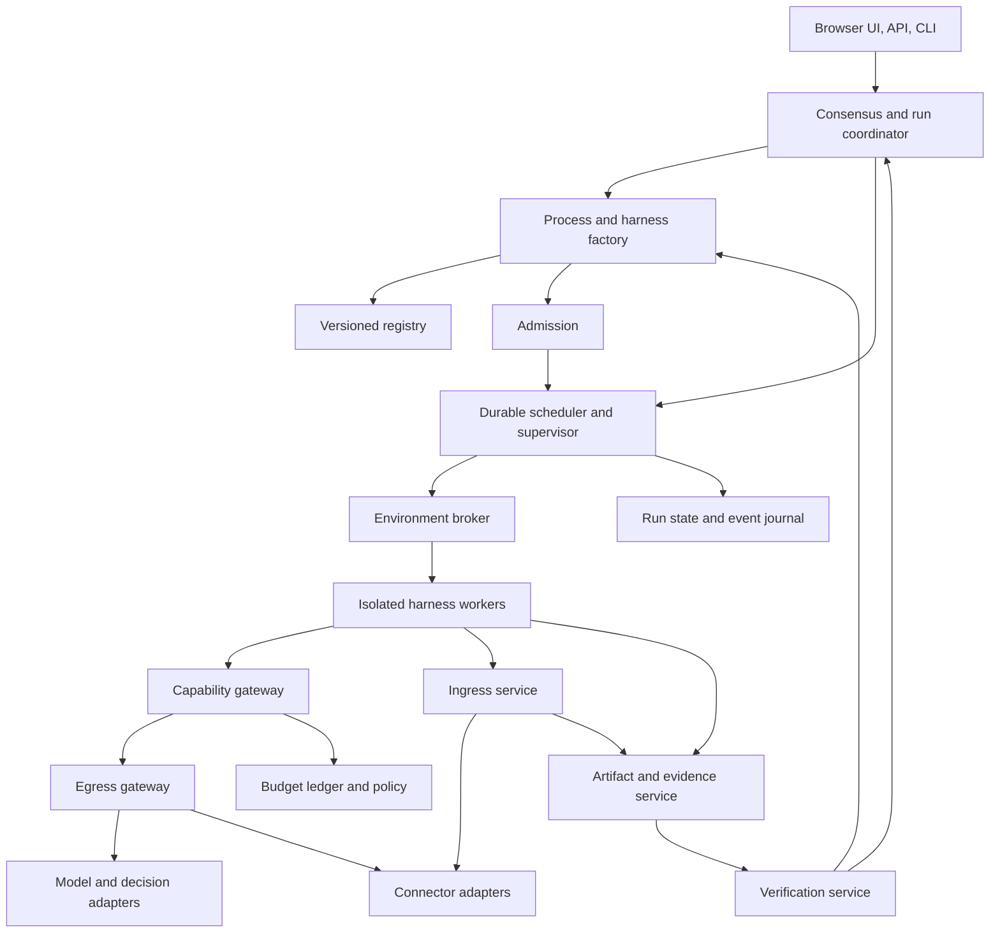
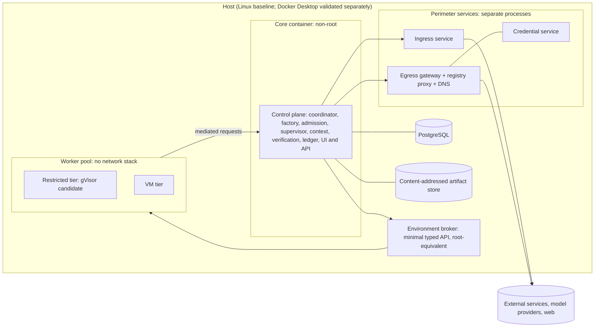
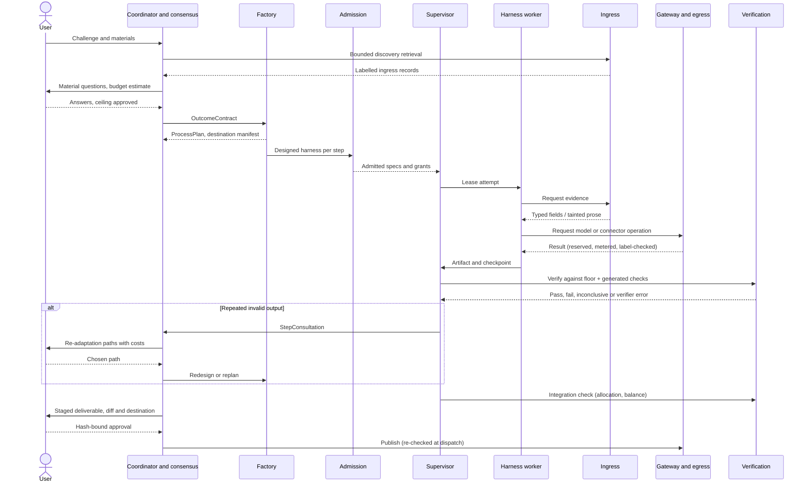

# L2 Technical Brief

Draft for architectural review · October 4, 2026 · restructured October 5, 2026

L2 is a general-purpose successor to Loom. A user brings a challenge. L2 agrees the intended outcome with them, designs a process to reach it, and synthesizes a harness for every step of that process. It then adapts those harnesses as evidence changes its understanding of the work. A harness can include generated execution logic, tools, decision policies, verifiers and isolated environments. A stable runtime enforces the user's agreements, authority, budget and artifact integrity throughout.

This is a high-level design. It sets out purpose, decisions, invariants, architecture and the main subsystems. Interface detail is left to companion specs. Nothing here claims that L2 exists yet.

**Status labels.** Each section opens with a status line:

- **Established** means agreed with the user.
- **Proposed** means a design recommendation that has not been agreed.
- **Open** means unresolved; section 21 lists these.

**Companion documents**

| Document | Contents |
| --- | --- |
| [L2-SECURITY-THREATS.md](L2-SECURITY-THREATS.md) | Threat catalogue, standard defenses and their adaptive-attack status, candidate detection methods, security evaluation plan |
| [L2-DECISION-MODELS.md](L2-DECISION-MODELS.md) | Provider notes (perishable), policy calibration procedure, deployment states |
| Interface specs (to be written) | Harness runtime protocol, ingress record, egress request, decision service, connector manifest, API and CLI |

---

## 1. Purpose, users and scope

*Status: Established October 5, 2026, except where marked*

**Primary goal.** Build a dynamic system that adapts to solve or complete complex challenges and problems.

**Users.**

- **Open-source reference.** A public GitHub repo for harness engineers and anyone else who wants to learn from or reuse the patterns.
- **Operators.** You and your internal teams. Each person runs their own instance with their own connection profile.

**What release one must deliver as a reference.**

- A public GitHub repo.
- Readable architecture docs, so others can learn the patterns without running L2.
- Easy self-hosting with Docker.

**Release-one success.**

- **Works end to end on one real task.** *Open: which task.*
- **Beats a strong single-harness agent.** *Open: the measure and the baseline will be set once the work is further along.*

**Non-goals for release one.**

- Multi-user support and organization administration.
- Certifying real-world outcomes.
- Exactly-once external effects.
- Frontends other than the browser.

**How the established decisions serve the goal.** The decisions in section 2 are how L2 reaches its goal. They are not separate goals. They cover full synthesis, ongoing adaptation, consultation instead of termination, consensus, scope protection, budget agreement, decision models and the security perimeter.

---

## 2. Established decisions

*Status: Established (agreed October 4–5, 2026). Wording of some rows is Claude's summary of the decision; confirm during review.*

| Area | Decision |
| --- | --- |
| Product | General-purpose successor to Loom. No requirement to preserve its implementation or process format |
| Synthesis | Full synthesis, including new tools and execution-loop logic. **Every step gets a designed harness**, built from reused components where they fit |
| Adaptation | Ongoing adaptation of harnesses and of the overall process |
| Termination | **L2 never abandons a step or a run on its own.** When a step keeps failing to produce valid output, it pauses and the user is consulted about how to re-adapt |
| Consensus | Raise unresolved choices whose answers would materially change the output. Show the recommended path and why. Always allow a typed response |
| Scope | Minimize consequential assumptions. Detect changes in meaning, emphasis, audience and intended use throughout the run |
| Economics | Propose an approximate budget for acceptance or rejection. Track actuals against it. Increases need explicit approval |
| Decision models | A core capability. Analyze their use throughout L2 to improve inputs, outputs, context efficiency, execution and economics |
| Deployment | Docker deployment for the core, with generated workloads isolated separately |
| Interface | Browser UI served by the deployment, plus API and CLI for automation |
| Identity | One connection profile per instance and one configured account per connected service. Separate identities need separate instances |
| Extensions | Generated code and dependency installation may run in isolation within approved limits. New credentials, paid commitments and broader access need a user decision |
| External actions | Staging happens autonomously within scope. Publication and other consequential external actions need authorization unless it was already granted |
| Reuse | Persist versioned harnesses, tested tools, decision policies and explicit preferences. Project evidence stays within its project |
| Verification trust | Generated verifiers only add checks. A fixed, non-generated verification floor compiled from the outcome contract is the root of trust |
| Step isolation | Each step runs in a constrained harness with its own capability scope. Taint carried on artifacts enforces the Rule of Two across steps |
| Untrusted ingress | All untrusted data enters through one fixed ingress service that does all retrieval. Tainted prose may feed only drafting steps that have no external-effect capabilities |
| Egress | All outbound traffic passes through one identity-bound egress gateway. Each run has a closed set of destinations derived from the contract. A new destination needs a user decision |
| Data labels | Data from connectors and uploads is private by default. Calls to model and decision providers are routed by confidentiality label |
| Security screening | Decision models screen untrusted content as a first pass. They can tighten exposure but never grant capability or remove taint |
| Design examples | A complete Texas grade 7 mathematics course delivered through an existing learning framework. A construction estimate from a supplied folder |

---

## 3. Core invariants

*Status: Established October 5, 2026. Reviewed one by one with Scott; invariant 3 was reworded at his direction.*

Every subsystem in this brief exists to keep these true. Each one needs a deterministic test (section 18).

1. **Generated code never runs in the control plane.** It runs only in isolated worker environments.
2. **No capability without a grant.** Naming a capability in a spec does not confer it. Only the grant engine issues grants, and the factory cannot grant itself anything.
3. **Spend is always committed against the currently approved budget.** Every paid operation is reserved first. The budget is not fixed. Any replan or redesign produces a re-forecast. If the re-forecast exceeds the approved budget, L2 proposes a budget revision. Approved revisions raise the budget, and reservations may then exceed the original estimate.
4. **No untrusted path to an effect without a gate.** Every path from untrusted ingestion to an external-effect capability passes a declassification gate: typed extraction, a deterministic transform, or user approval.
5. **Generated verifiers only add checks.** No acceptance criterion rests on a generated verifier alone.
6. **No publication without hash-bound approval.** Approval binds to the artifact revision, the destination and the contract revision, and is re-checked at dispatch.
7. **No destination outside the manifest.** The egress gateway contacts only destinations declared for the run.
8. **Model output is never consent.** Silence, timeouts, preselected options and model recommendations do not count as user decisions.
9. **No abandonment without the user.** L2 pauses and consults. It never quietly drops a step, lowers a requirement or ends a run.
10. **Workers never write authoritative state.** The supervisor validates and commits every worker message against the expected revision and receipts.

---

## 4. Architecture

*Status: Proposed*

### Planes and components

L2 has a trusted control plane and an isolated execution plane. The factory is ordinary application logic with model assistance. It has no special right to change permissions, agreements or budgets.



The boxes are responsibility boundaries, not one microservice each.

| Component | Owns | Must not |
| --- | --- | --- |
| Consensus service | Outcome revisions, user decisions, unresolved material interpretations, step consultations | Treat model recommendations or silence as approval |
| Factory | Process decomposition, harness design for every step, redesign proposals | Grant itself capabilities or revise agreed success conditions |
| Admission | Validating specs, generated code, verifiers and plan-level properties before activation | Admit on the factory's word or on fixtures the factory alone wrote |
| Supervisor | Scheduling, leases, checkpoints, cancellation, revisions, failure counting | Trust a worker's claim of success without the required receipts |
| Capability gateway | Policy checks, scoped operations, usage accounting | Expose raw secrets or privileged host operations |
| Ingress service | Retrieval, normalization, screening, quarantined extraction, taint and confidentiality labels | Pass untrusted text as trusted, reveal screening verdicts, or accept schemas the runtime has not validated |
| Egress gateway | Outbound requests, attaching credentials, enforcing the destination manifest, label checks | Attach foreign credentials, contact undeclared destinations, or send private-lineage data to uncleared destinations |
| Context service | Evidence selection, packet construction, lineage | Turn retrieved instructions into authority |
| Verification service | Checks and verdicts against explicit contracts | Let a producer weaken the contract to get a pass |
| Environment broker | Provisioning, limits, teardown, execution receipts | Accept arbitrary container or hypervisor commands from generated code |
| Registry | Versioned components, evaluation evidence, applicability | Treat one successful run as general validation |

### Deployment view



Proposed: ingress, egress and the credential service run as separate processes with their own privileges. A compromise of the control plane would then not hand over credentials or raw network access. Section 21 tracks this as an open decision against running them as modules inside the core. Workers reach every other component only through the mediated runtime interface.

### Key interfaces

These are the boundaries that need specs before implementation. The harness runtime protocol matters most, because it carries the security model.

| Interface | Between | Carries |
| --- | --- | --- |
| Harness runtime protocol | Worker ↔ supervisor and gateway | Observe evidence, request operations, submit artifacts, checkpoint, propose questions or redesigns, finish with evidence |
| Ingress record | Ingress → context and artifact services | Source, hash, normalization findings, labels, typed fields, excerpts with span references |
| Egress request | Gateway → egress | Destination, payload reference, label, credential binding, idempotency key |
| Decision service | Any control-plane component → decision adapters | Policy, state, typed result, distribution, receipt |
| Connector manifest | Connector → registry | Operations, schemas, side-effect class, labels, scopes, idempotency, cost |
| API and CLI | Clients → coordinator | Runs, contracts, questions, budgets, artifacts, harness revisions, connectors, events. Idempotency and expected-revision fields on every mutation |

### Contracts and records

Every boundary uses typed, versioned contracts. Large content lives in referenced artifacts, not nested state.

| Record | Essential contents |
| --- | --- |
| OutcomeContract | Goal, audience, deliverables, scope and exclusions, priorities as an emphasis allocation, acceptance criteria, uncertainty expectations, publication authority, originating decisions, revision |
| ProcessPlan | Nodes and dependencies, input and output contracts, harness assignments, declassification gates, destination manifest reference, checkpoints, completion requirements, cost estimate, revision |
| HarnessSpec | Objective, observations, entry point or graph, capabilities, environment, context policy, decisions, verifiers, recovery, resource limits, checkpoint schema, dependency hashes |
| HarnessAdmission | Spec hash, checks performed, fixture results, permission ceiling, operating mode, residual limitations |
| DecisionPolicy | Question, output type, required state, domain, provider and version, calibration reference, thresholds, consequences, uncertainty and outage behavior |
| DecisionReceipt | Policy and version, input references, typed result, distribution, provider confidence, selected action, timing, usage, escalation |
| ContextPacket | Contract revision, objective, excerpts, artifact references, contradictions, open issues, lineage, taint labels, agreement hashes, token accounting, omitted-evidence index |
| UserDecision | Question, distinct options, recommendation and rationale, consequences, typed response, normalized interpretation, affected work, author, time |
| StepConsultation | Failing node, attempts and failure evidence, approaches tried, proposed re-adaptation paths with costs, user decision |
| MemoryRecord | Kind (decision, fact, preference, open question, artifact reference, summarized tool result), content or reference, source and lineage, taint and confidentiality labels, created and superseded-by, project scope |
| BudgetRevision | Estimate range, authorized ceiling, inclusions, reservations, forecast assumptions, approval, currency, revision |
| ArtifactRevision | Content hash, media type, producer attempt, lineage, taint and confidentiality labels, contract revision, verification receipts, status, retention |
| IngressRecord | Source, content hash, retrieval time, parser version, normalization findings, labels, typed fields, excerpts with span references, screening receipt reference (never shown to harnesses) |
| DestinationManifest | Closed set of external destinations for the run, each with provenance and permitted labels, revision |
| CapabilityGrant | Run and attempt, permitted operation and resources, expiry, limits, connection binding, approval reference |
| ExecutionAttempt | Spec and input hashes, lease and generation, environment receipt, checkpoint, action receipts, usage, result |

A decision-model result and a user decision are different record types. However confident a prediction is, it never becomes an agreement.

A harness can run arbitrary generated logic inside its environment. Everything that crosses the boundary goes through the runtime protocol. Checkpoints happen at mediated action boundaries and at explicit worker checkpoints. Arbitrary machine state is not promised to be resumable.

The fragment below illustrates a HarnessSpec. It is not a final schema. The runtime resolves and pins every reference before admission. Naming a capability does not grant it.

```yaml
spec_version: 1
objective_ref: outcome/current/comparison
inputs: { baseline: artifact_ref, candidate: artifact_ref, cases: artifact_ref }
execution: { entrypoint: generated_compare.py, code_ref: artifact_ref, checkpoint_schema_ref: schema_ref }
capabilities: [execute_case, read_evidence, request_model]
environment: { class: disposable_vm, network: none, manifest_ref: artifact_ref }
context: { policy_ref: comparison_context_v1 }
decisions: { discrepancy_kind: policy_ref }
verification:
  - { criterion_ref: outcome/current/behavioral_equivalence, verifier_ref: independent_comparison_verifier }
recovery: { retry_limit: 2, on_repeated_invalid_output: consult_user }
resources: { budget_allocation_ref: approved_allocation_ref, environment_lease_ref: approved_lease_ref }
outputs: { observations: structured_artifact, comparison_report: document_artifact }
```

---

## 5. Security perimeter

*Status: Established decisions; mechanisms Proposed. The full catalogue is in [L2-SECURITY-THREATS.md](L2-SECURITY-THREATS.md).*

This section is the single source for security rules. Other sections refer back to it rather than repeating them.

### Position

Published work is consistent on two points:

- Detectors and prompt-level defenses fall to adaptive attackers, usually at attack success rates above 90%.
- The defenses with a principled argument are deterministic and out-of-band: capability grants, information-flow labels, isolation and controlled egress. They cost utility, and only one has been independently tested against adaptive attacks.

L2 therefore treats boundaries the model cannot reach as its security. Screening is telemetry that raises the attacker's cost.

L2 also adds attack surfaces of its own. The factory reads untrusted evidence and then writes code. Generated verifiers can be gamed. Registry reuse lets a poisoned component persist. A synthesized process graph can assemble the lethal trifecta across steps even when every individual step is clean.

### The perimeter

| Layer | Mechanism | Defends against |
| --- | --- | --- |
| Ingress | One fixed service does all retrieval. Workers have no network stack. Content is normalized deterministically, screened, extracted by a quarantined model with no tools or egress, and labelled | Direct and hidden injection, generated code bypassing the perimeter, poisoned connector content |
| Typed and prose lanes | Typed fields (enums, numbers, dates, bounded strings, span references) can be declassified under rules the runtime validates. Prose stays tainted and feeds only drafting steps that have no effect capabilities | Injected instructions reaching action parameters |
| Step isolation | Capability scope per step. Taint follows artifact lineage. At plan time, every untrusted-to-effect path must pass a gate | Laundering across steps; the lethal trifecta assembled across a pipeline |
| Factory admission | Clean-room differential synthesis, capability inference, the fixed verification floor, taint carried into the registry | Instructions smuggled into generated harnesses, verifier gaming, persistent poisoned components |
| Context integrity | Agreement-hash audit before every model call; contracted emphasis allocation | Compaction and eviction attacks; emphasis drift from volume poisoning |
| Egress | Identity-bound gateway, closed destination manifest per run, label-flow checks, content matching after decoding, inert rendering, provider routing by label | Exfiltration over network, DNS, rendering, approved domains, connector writes and provider endpoints |
| Approvals | Rendered by the control plane, bound to hashes, re-checked at dispatch, model text confined to a labelled panel | Forged dialogs, approval fatigue, truncated arguments |
| Resource controls | Reserve-and-settle ledger, deviation from the per-step forecast, per-item screening budgets | Denial of wallet, amplification, denial of service against guardrails |
| Execution isolation | Minimal typed broker API, gVisor or VM tiers, registry proxy for dependencies | Sandbox escape, misuse of the broker, slopsquatting and malicious packages |

### Rules that span subsystems

- **Labels.** Every ingress record and artifact carries two labels:
  - an integrity label (taint);
  - a confidentiality label: private, project or public.

  Data from connectors and uploads is private by default. Public web retrieval is public. A payload's labels are computed from its lineage.
- **Schemas decide declassification, and the runtime checks them.** The factory may design an extraction schema for each step, but fixed runtime rules validate it. The rules include:
  - No long free text may flow into an action parameter.
  - Enum values for effect parameters come from the contract or the user's own answers.
  - Recipients, destinations and URLs come from trusted sources only.
- **Screening only tightens.** A decision-model screen can quarantine or block content. It can never remove taint or grant a capability. Verdicts are not shown to the harness being screened. If screening fails or overruns its budget, the item is quarantined. Section 7 covers the screening design.
- **Destinations are closed per run.** The process plan derives a DestinationManifest from the contract and the user's answers. Adding a destination during a run requires a consensus question.
- **Providers are routed by label.** Private data goes only to model and decision providers cleared for it, which can include local models. This doubles as data-residency control for Canadian deployments under PIPEDA and provincial law such as Alberta's PIPA.
- **Credentials stay with the gateway.** Workers never hold provider credentials. The gateway attaches only credentials it issued and rejects any request that carries foreign ones.

### Accepted residual risk

Two risks can be reduced but not eliminated:

- low-bandwidth covert channels, such as word choice or timing in legitimate output;
- careless approval of a deliverable that contains private data.

Bandwidth limits, label checks and approvals that show diffs reduce both.

### Candidate contributions

Three detection methods appear novel in the form L2 can implement them:

- clean-room differential synthesis;
- contracted emphasis allocation;
- anomaly detection based on deviation from the forecast.

The rest build on published work, and the companion document credits it. Any novelty claim needs a full literature review before publication.

---

## 6. Run lifecycle

*Status: termination and synthesis policy Established; the rest Proposed*

### Walkthrough

One run from intake to delivery.



### Stages

1. **Intake.** Identify supplied materials, existing agreements, constraints and missing capabilities. Preserve the original request.
2. **Bounded discovery.** Inspect enough to propose scope, approaches, major decisions and a budget. Paid discovery uses a configured allowance or asks for one first.
3. **Consensus.** Resolve material choices. Establish the outcome contract, its emphasis allocation and the authorized ceiling. If the user declines the estimate, revise or stop in an orderly way.
4. **Process design.** Propose dependencies and completion evidence. Derive the destination manifest and the declassification gates.
5. **Harness design.** Design a harness for every step (see the synthesis policy below).
6. **Admission.** Validate each spec, the generated code and the generated verifiers. Check the plan-level information-flow and destination properties.
7. **Execution.** Run eligible steps as isolated attempts with explicit artifact handoffs.
8. **Continuous review.** Check correctness, evidence gaps, progress, scope alignment and the budget forecast at meaningful boundaries.
9. **Adaptation.** Repair, redesign, replan or consult, depending on the failure.
10. **Integration.** Verify the assembled deliverable against the contract, including its overall balance. Prepare a staged result for review.
11. **Delivery.** Publish only within recorded authority. Keep receipts, limitations, costs and reuse candidates.

### Synthesis policy

*Established: every step gets a designed harness.*

The factory produces an explicit HarnessSpec for every node in the process plan, and each one goes through admission. Designing a harness does not mean writing it from scratch. The factory assembles it from evaluated registry components and the shipped capability catalog where they fit, and generates new logic, tools and verifiers only where they don't.

Proposed refinement: nodes instantiated from one template may share one admitted design, instantiated per node. An example is one node per lesson in a 40-lesson course. Without this, design and admission costs grow with the number of steps.

This policy gives the most tailoring and the highest cold-start cost. Discovery estimates must include factory design and admission work, and the cost of each design is tracked separately so the economics can be measured (section 20).

The factory starts from a shipped, versioned design protocol and capability catalog. Replacing the trusted runtime or its enforcement policy is a software upgrade, not in-run adaptation. That gives full synthesis a finite bootstrap boundary. The factory cannot create unrestricted factories.

### Adaptation levels

| Level | Example | Required controls |
| --- | --- | --- |
| Local repair | Retry a transient failure or fix a malformed artifact | Bounded attempts, same contract, evidence of progress |
| Harness redesign | Replace speculative analysis with a runnable experiment | New spec revision and admission, budget reservation, input compatibility |
| Process replan | Add investigation after contradictory evidence invalidates a dependency | Impact analysis, dependency revision, invalidation of stale outputs, consensus if outcomes change |

Every redesign states the failed hypothesis, the supporting observations, the expected improvement and the maximum additional spend.

### Consultation instead of termination

*Established: the user is consulted before anything is abandoned.*

A step's output is valid when it passes admission checks and the verification floor for its criteria. The supervisor counts consecutive invalid outputs per step across repair and redesign attempts. It does not rely only on failure fingerprints, because an attacker or a flailing model can vary those indefinitely.

When the count reaches the step's threshold (proposed default: three invalid outputs across at least two distinct approaches), the step pauses and opens a **StepConsultation**. The same happens when factory nesting depth or a redesign cap is reached. The consultation shows:

- what was tried and the evidence for each failure;
- distinct re-adaptation paths, each with a cost estimate:
  - a new approach the factory proposes;
  - a revised step or scope;
  - accepting a partial or degraded result, with the gap stated in the deliverable;
  - skipping the step with a documented gap;
  - stopping the run;
- the work that is blocked and the work that can carry on.

Independent steps keep running while one step waits. Headless runs pause and notify.

Consultation is a design choice, not a cost to minimize. Consultation leads to consensus on expectations, and consensus on expectations leads to higher quality. Consultation counts are tracked so the thresholds can be tuned, not as a target to drive down.

L2 ends a run only on a user decision, or when the hard budget ceiling is reached with no approved increase. Even then, a forecast-triggered budget question comes first (section 13).

### Change and fencing

When a contract or an input changes, the coordinator identifies the affected artifacts and their descendants. Unaffected work continues. Affected attempts are fenced from promotion until they are checked or restarted against the new revision. Late results are recorded, but a late worker cannot overwrite a newer accepted result.

### Admission

Admission covers:

- schema and dependency validation;
- allowed-capability checks;
- bounded execution;
- behavior on missing inputs;
- timeout and cancellation tests;
- artifact path isolation;
- success and failure fixtures.

Generated verifiers are tested on known-valid and known-invalid inputs, including cases the producer did not create. They can only add to the fixed floor.

Some harnesses are designed while tainted evidence is in the factory's context. Admitting one of these also requires two checks:

- **Clean-room differential synthesis.** A second design is produced with the evidence withheld, and the two are compared on capabilities and data flow. Behavior that appears only in the evidence-informed design is flagged and attributed to the evidence that caused it.
- **Static capability inference.** The capabilities the generated code actually uses must match the declared capabilities.

Components designed under taint keep that taint in the registry.

Passing fixtures is evidence, not proof of correctness. New semantic policies start in advisory or constrained mode where warranted. An unvalidated material judgment gets stronger review, or its uncertainty is preserved instead of turned into false certainty.

---

## 7. Decision models

*Status: Established as a core capability. Specific uses are Proposed until measured. Provider notes and calibration procedure are in [L2-DECISION-MODELS.md](L2-DECISION-MODELS.md).*

Decision models are one of the newer pieces of L2, and possibly one of its larger economic levers. They don't generate text. They evaluate a typed question against supplied state and return a structured answer, usually with a probability distribution: a choice from a list, a score on a rubric, or a yes probability.

A frontier model can make the same judgments, but it is slower, costs more and is harder to calibrate. If a harness can delegate its many small judgments to fast, typed decisions, it can afford to check far more often. It can ask whether a passage fills a gap, whether a claim is supported, whether a step is still making progress, or whether a proposed action fits the contract. The frontier model then does the work only it can do.

That is the hypothesis. This section explains where it might pay off and how L2 finds out.

### Principles

1. **Narrow and atomic.** Ask one bounded question at a time and combine the answers in code. Compound judgments ("is this report good?") are decomposed.
2. **Advisory, never authoritative.** Permissions, arithmetic, hard budget limits and hard requirements stay deterministic. A decision can route, rank, flag or escalate. It cannot grant, pass or consent.
3. **Receipts, not reasons.** Every decision writes a receipt with its state references, typed result, distribution and the rule applied. If someone needs an explanation, a generative model can explain the receipt, labelled as a later explanation and not as the decision model's reasoning.
4. **Insufficiency is an answer.** Policies include "insufficient evidence" or "none of the above" outcomes where they fit. If a provider can't express that natively, the surrounding policy detects insufficiency before acting.
5. **Confidence is provider-specific.** A provider's confidence score is not a probability of being correct, and it means different things for different question types. L2 keeps raw distributions, never multiplies confidences across dependent decisions, and sets thresholds on representative data.
6. **Measured before trusted.** Every use is compared with four alternatives: code, existing retrieval, a frontier judgment, and skipping the check altogether. A use stays only if it improves cost per accepted outcome.

### Decision service

The service is the only path from any control-plane component to decision providers. It advertises each provider's actual capabilities:

- input modalities and typed result kinds;
- maximum state and option sizes;
- whether distributions are available;
- version pinning;
- batch behavior;
- observed latency;
- usage reporting.

Unsupported fields stay absent. If a frontier model is used as a fallback, the receipt records a different backend and the fallback does not inherit the other model's calibration.

Policies follow a lifecycle: experimental, shadow, advisory, active, retired. Shadow decisions are logged but never control execution. Revalidation is required whenever the question, rubric, provider version, input distribution or consequences change. If a provider is down, the declared fallback runs or the branch pauses. An outage never produces a silent pass.

Decision calls are also outbound data flows. They go through the egress gateway and are routed by label like any other provider call.

### Where they fit in the lifecycle

The tables list candidate uses by stage. Each candidate is a hypothesis to measure, not a commitment.

**Intake and consensus**

| Judgment | What it enables | If wrong or uncertain |
| --- | --- | --- |
| Would plausible answers to this question materially change the deliverable? | Ask only consequential questions | Escalate ambiguous material cases; sample suppressed questions to catch missed assumptions |
| Are the offered options actually distinct? | Remove cosmetic alternatives and reduce question fatigue | Ask a focused free-text question instead of forcing a menu |
| Does this typed answer change meaning when normalized? | Confirm only when the interpretation shifts | Show the normalization back to the user |
| Does this proposed action or draft depart from the contract's scope? | Catch interpretation drift early | Hold dependent work; present distinct paths to the user |

**Process and harness design**

| Judgment | What it enables | If wrong or uncertain |
| --- | --- | --- |
| Is a prerequisite missing from this step? | Flag plan defects for the planner | Check topology in code; send complex dependencies to frontier reasoning |
| Which registry component fits this step's declared conditions? | Reuse evaluated parts inside each step's design | If nothing fits, generate new logic; never force a near match |
| Which permitted environment class suits these operations? | Right-size isolation and compute | Runtime minimum-isolation rules override |
| Does this generated code look suspicious? | Route it to closer admission review | Advisory only; never admits anything |

**Context and evidence**

| Judgment | What it enables | If wrong or uncertain |
| --- | --- | --- |
| Does this passage address a current evidence gap? | Admit promising evidence before costly synthesis | Keep excluded originals; sample for false exclusions |
| Does this memory record fill a gap for the current step? (recall full scan) | Automatic recall without the agent having to ask | Structural inclusion and supersession filtering stay deterministic; selection is budgeted |
| Is this new information? | Reduce repetition | Keep independent corroboration and conflicting findings |
| Is this source suitable for this kind of claim? | Route uncertain sources for corroboration | Missing metadata stays unknown; relevance never proves credibility |
| Do these claims contradict each other? | Trigger reconciliation or more retrieval | Never discard disagreement because it conflicts with a draft |
| Is this packet sufficient for the step? | Catch missing inputs before an expensive call | Expand retrieval or mark the step blocked, with a bounded number of checks |
| Is evidence concentration turning into implied priority? | Early warning for emphasis drift | Broaden evidence or raise a question. The deterministic allocation check (section 8) remains authoritative |
| Does this summary faithfully represent its sources? | Catch omissions and additions after compaction | Restore excerpts or regenerate with stronger review |
| Which tools matter for the current objective? | Smaller tool lists in prompts | Discovery stays available; a filter can never grant a permission |

**Execution and adaptation**

| Judgment | What it enables | If wrong or uncertain |
| --- | --- | --- |
| What kind of failure is this tool outcome? | Choose retry, repair, a new method or investigation | Transport and auth errors are handled directly; unclear causes go to diagnosis |
| Is this step making measurable progress? | Reach consultation sooner when it isn't | Deterministic failure counters stay authoritative |
| Repair, redesign or replan? | Propose the right adaptation level | The factory reviews uncertain or high-impact structural changes |
| Is this departure from the forecast benign or suspicious? | Separate legitimate surprises from amplification or injection | Pause and diagnose; the hard ceiling stays authoritative |
| Which remaining action has the best expected value? | Inform spending priorities | User priorities and hard ceilings take precedence |

**Verification and integration**

| Judgment | What it enables | If wrong or uncertain |
| --- | --- | --- |
| Does this extracted record need expensive re-extraction? | Spend only where records are uncertain | Arithmetic, units and schema checks stay executable |
| Is this claim supported by this exact source context? | Catch citation mismatches before finalizing | Unknown support triggers retrieval or a qualified statement, never an invented citation |
| Does this artifact slice meet this one criterion? | Run frequent checks close to production | Material or novel cases get stronger independent verification. Never the only gate |
| Does this frame, page or audio segment show a known defect? | Catch defects before expensive final assembly | Requires native support for the modality; a transcript can't prove visual correctness |
| Do the assembled parts overlap, contradict, or leave gaps in handoffs? | Integration review across the whole deliverable | Reopen the affected steps; keep passed artifacts that still apply |

**Security**

| Judgment | What it enables | If wrong or uncertain |
| --- | --- | --- |
| Does this content contain instructions aimed at an AI, requests to send data, references to tools or credentials, attempts to change the task, or text addressed to a reviewer? | First-pass screening at ingress | Can only tighten: quarantine or block. Never removes taint |
| Does this changed connector description add instructions? | Force re-admission review | Treat descriptions as untrusted regardless |
| Does this outbound payload contain sensitive data of a declared type? | Catch paraphrased leaks that fingerprinting misses | Sends to review; deterministic label checks stay authoritative |

**Reuse**

| Judgment | What it enables | If wrong or uncertain |
| --- | --- | --- |
| Does this run's evidence make this component a promotion candidate? | Nominate components for reuse | Promotion needs held-out validation. The authoring model never certifies its own work |

### Screening design

Ingress screening is the most exposed use, so its rules are fixed:

- Deterministic normalization runs first: hidden Unicode, text hidden by CSS, image rescaling to the model's resolution, and length caps.
- Questions are atomic and include deployment context. Context substantially improves detection.
- There are three outcomes, and none of them is an unconditional pass:
  - proceed, still tainted;
  - quarantine: typed extractions only, effect capabilities removed;
  - block and surface to the user.
- Verdicts are logged but never shown to the harness being screened.
- Every item has a hard screening budget. Guardrails can themselves be attacked to burn tokens. An overrun or an outage quarantines the item.
- Thresholds are calibrated on held-out data that includes benign text full of trigger words, so over-blocking is measured alongside misses.
- Proposed option: rotate among equivalent question phrasings and providers so attackers can't tune content offline against one fixed detector. Its value has to be measured as added attacker cost.

Published results support only this advisory role. Adaptive attacks have broken detectors in general. An adaptive study that attacked Jev as a decision-maker hijacked 1.8% of decisions with static attacks and 3.5% with adaptive ones.

### Economics

The quantity that matters is net value: frontier work and rework avoided, minus decision calls, added latency, escalations, and losses from wrong decisions. Fewer prompt tokens alone don't prove better economics. Cost per accepted outcome is the primary comparison.

An illustration, not a price quote. Suppose 100 calls each avoid 12,000 input tokens at $2 per million. The gross saving is $2.40. If the decision processing costs $0.15, that leaves $2.25. One wrong exclusion that forces a $3 rerun wipes out the gain. Error cost dominates, so action-specific error rates matter more than averages.

Scheduling rules:

- Batch independent questions over shared state.
- Split dependent decisions into stages.
- Cache only on complete semantic keys: evidence content, agreements, question and rubric, provider and version, policy, and freshness.
- Keep caches within a project unless broader reuse is explicitly safe.
- Don't evaluate speculative questions just because each one is cheap.

### Evaluation

Run four configurations on the same fixtures:

1. no new gate;
2. deterministic gate;
3. decision-model gate;
4. frontier-model gate.

Add context-only and combined variants to isolate where the benefit comes from. Track cost, latency, final acceptance, evidence recall, escalation rate, repair counts and user interruptions.

Fixtures include missing evidence, misleading options, contradictions, prompt injection, domain shift, and minority-but-important evidence. Development examples are kept separate from held-out evaluation. Model-generated labels can bootstrap exploration but are never the only ground truth.

Measure error rates and abstention coverage per action. For source exclusion, the critical number is recall of necessary evidence. For acceptance checks, it is false passes.

### Risks specific to decision models

- **Question gaming.** Generated questions can be gamed or badly scoped. Both the question and its mapping to an action are validated, and permission and spending gates are checked regardless of the answer.
- **Calibration drift.** Calibration drifts when providers update models. Pinned versions and revalidation triggers manage it.
- **Provider risk.** Providers are young. One is in limited preview without a public schema or pricing. The service abstraction exists so that L2 can drop or swap a provider without redesigning anything (companion document).

---

## 8. Consensus and scope

*Status: behavior Established; mechanisms Proposed*

### When to ask

The test for asking is counterfactual. Would plausible answers lead to materially different outputs, and are the options on offer actually different from each other? Material effects include audience, emphasis, exclusions, deliverable form, success criteria, cost, timing and external commitments.

Before asking, L2 checks whether the answer is already agreed or can be found in authorized evidence. Questions don't outsource ordinary research or repeat earlier agreements. If a question has two real paths, L2 shows two and does not invent a third for symmetry. A factual clarification can be plain free text.

A question includes:

- the issue and the evidence behind it;
- the distinct paths, a recommendation with its rationale, and the consequences of each path;
- the affected steps, and whether independent work can continue.

The evidence lists the sources behind each option and their taint status. A recommendation that rests mostly on tainted sources, or on a single cluster of sources, says so. This is a guard against an attacker steering the user through the question itself.

Typed responses are kept verbatim. If normalizing an answer would change what it means, L2 confirms the interpretation. It doesn't ask for confirmation of an answer that is already clear. No response, a preselected option or an elapsed timeout is never treated as approval.

### Evidence and authority stay separate

User agreements, observed evidence, provisional interpretations and proposals are distinct categories:

- A source can support a fact without supporting a change in strategy.
- An accepted preference can govern emphasis without making any factual claim true.
- New evidence that contradicts the factual premise of an agreement reopens the issue with the user. It is not suppressed.

Applicable agreements appear in every execution and review packet. Outstanding material assumptions block the work that depends on them. Routine reversible choices proceed under the agreed policy and stay inspectable.

### Emphasis allocation

The contract's priorities take a concrete form: ranked topics or segments, each with an emphasis band and a tolerance. Users can rank them and let L2 infer the bands.

- Outlines and sections are tagged to these topics, deterministically wherever possible.
- At outline formation, during drafting and again at integration, the space and recommendations each topic actually receives are compared with the contract.
- Drift outside tolerance blocks progress and either opens a question or triggers broader retrieval.

Emphasis isn't a formula. A strategy or an obligation can justify a disproportionate share, but that justification has to be agreed.

The same check catches the accidental failure (retrieval frequency turning into priority) and the adversarial one: volume poisoning with on-topic, slanted content that contains no instructions at all. Screening documents one at a time can't catch the adversarial case.

The regression fixture has three parts: a broad-market request, a stated small segment share, and a retrieval corpus dominated by that segment. L2 must keep the agreed allocation, look for broader evidence, and ask only when a substantive strategic alternative really deserves a decision. The same principle covers test-prep material taking over a general mathematics course, or an estimate quietly substituting premium materials. Parts that are each correct can still add up to a wrong whole.

---

## 9. Context and evidence

*Status: Proposed*

The context service builds each model call from ingress records and artifacts. Raw untrusted content never reaches a worker directly (section 5).

1. **Store originals.** Keep each original asset with its hash, origin, retrieval time, permissions, parser version and labels, plus page, row, timestamp or span locations.
2. **Retrieve cheaply first.** Do inexpensive structural extraction, exact-duplicate checks and candidate retrieval. Search snippets count as discovery, not as source evidence.
3. **Judge candidates.** Apply focused judgments to candidates against the current evidence gaps and the contract. Relevance, novelty, support and contradiction are evaluated separately (section 7).
4. **Admit sparingly.** Admit excerpts, or commission extraction or summarization, only where justified.
5. **Assemble the packet.** It contains the applicable agreements, the step's objective, evidence and counter-evidence, open questions, taint labels, and enough operational state to execute correctly.
6. **Check coverage and balance.** A set of individually relevant passages can still miss an essential perspective or prerequisite.
7. **Account for the whole request.** That means instructions, tools, attachments, history and output reserve. Valid tool-call and result pairs are kept together. If protected material doesn't fit, the task is split or the model changed. Agreements are never dropped. Before each call, every applicable agreement is checked by hash. If one is missing, the call fails closed.
8. **Record and preserve.** Record the packet hash and admission decisions. Workers can request originals or more context. Excluding something from a packet never deletes it.

### Memory recall

In Loom, the agent could query stored context with a tool but rarely did. In L2, recall happens before every model call as part of building the packet. The agent doesn't have to remember to ask.

Recall runs in this order:

1. **Structure first.** Include the agreements, decisions and open questions that apply to the step, and everything the step's inputs link to through lineage. These are found by lookup, not by a relevance score.
2. **A step-shaped query.** The query is the step objective, the relevant contract clauses and the open questions, not only the latest prompt. Indirect references ("do it like last time") rarely share words with the thing they mean.
3. **Full scan by decision model, per step.** Every memory record in scope is scored against the step query, in parallel batches. Nothing is lost to a bad keyword or embedding match. Scoring happens per step, not per model call: every record is scored when the step starts, new records are scored as they arrive, and everything is rescored only when the step query changes. Cost then scales with records × steps, not records × calls. At reported pricing a scan of a long run's history costs cents; the binding constraint is provider throughput, which concurrent harnesses share.
4. **Two-stage fallback.** If a scan would exceed the throughput budget for the step, a cheap keyword and embedding search proposes candidates first and the decision model reranks only those. Full scan and two-stage are compared on recall of needed context before either is committed as the default.
5. **Supersession filter.** Items replaced by a newer decision or fact are dropped or flagged. Stale context is worse than missing context.
6. **Budgeted, diverse selection.** Items are chosen within a token budget, with a diversity constraint, not on a threshold alone. A threshold alone can flood the packet with one topic, and evidence concentration turns into implied priority (section 8). Thresholds are set per policy from data, because provider confidence is not a calibrated probability.
7. **Labels travel with recalled items.** Tainted memory stays tainted and enters through the prose lane. A full scan gives every tainted record a chance to promote itself on every step, for example text written to look relevant to everything. Tainted records therefore get a capped share of the recall budget.
8. **Fallback, not primary.** Workers keep an expand handle to request specific items. The design aims for that handle to be rarely needed.

The relevance question itself needs testing. One published benchmark found a single compound question scored far lower than the same judgment split into atomic questions and combined in code. If "is this relevant to the step?" behaves like a compound question, it may need decomposing too.

Memory is stored as typed records (MemoryRecord, section 4), not as raw messages. A message mixes decisions, facts, chatter and tool output, and that mix retrieves badly.

Every recall is logged: what was included, what was left out, and whether the output drew on it. Recall is evaluated in five configurations: full scan, two-stage, agent-pull (the Loom approach), recent-N, and include-everything-relevant. The measures are recall of the context that was actually needed, and quality per token.

Selection depends on the stage. A passage that drafting doesn't need may be essential for verification, and reviewers retrieve independently of the producer's selection. A user correction invalidates affected packet caches. Summaries keep their derivation links and never outrank their sources.

---

## 10. Verification

*Status: floor and additive rule Established; strategies Proposed*

Verification is a set of strategies chosen per criterion, not one universal score.

| Strategy | Appropriate evidence | Limits |
| --- | --- | --- |
| Structural | Schemas, required files, links, units, counts | Says nothing about semantic quality |
| Executable | Tests, calculations, simulations, differential outputs | Covers only specified properties and exercised cases |
| Semantic decision | A narrow claim or criterion with supporting context | Needs task-specific evaluation and uncertainty handling |
| Independent generative review | Complex reasoning, contradictions, design critique | Can share the producer's errors; use independent evidence |
| Visual or media inspection | Rendered pages, browser state, frames, audio | Must inspect the actual modality and the final artifact |
| User review | Material preferences, representative deliverables, final commitments | Not a substitute for checks L2 can run itself |
| Field evidence | Learner outcomes, operational measurements, project results | Often unavailable during production; report where evidence stops |

**The floor.** A fixed, non-generated set of checks is compiled from the outcome contract: structural, executable, arithmetic and policy checks. It is the root of trust. Generated verifiers can only add to it.

**Isolation from producers.**

- Verifier files are read-only to producers.
- Producers never see verifier source.
- Impossible probes may be inserted into live runs to measure gaming.

**Verdicts.** A verdict is pass, fail, inconclusive or verifier error. Verifier failure is not artifact failure, and missing evidence is not a pass. A hard requirement can't be averaged away by high scores elsewhere. Criteria are recorded separately from preferences and advisory improvements.

**What gets checked.**

- Artifact integrity, semantic correctness, agreement alignment and whole-output balance.
- Producer and verifier may use different providers or methods, but different providers alone don't prove independence. Shared sources and derivation lineage matter.

**Changes after approval.**

- A generated verifier can't revise the criteria it enforces. Any proposed relaxation becomes a visible contract change.
- Publication checks bind to the artifact hash and the destination. A material edit to an approved artifact invalidates the approval.

---

## 11. Execution isolation and deployment

*Status: Docker Established; mechanisms Proposed*

The core ships as a Docker deployment with persistent database and artifact storage. Generated work never runs in the core's process.

Container configuration is part of the security boundary. Docker's own guidance describes the attack surface of the privileged daemon and the risk of broad host mounts. Generated workers never get a Docker socket or daemon API. Rootless mode is worth evaluating, but it doesn't make arbitrary code safe. [Docker security](https://docs.docker.com/engine/security/) · [Rootless mode](https://docs.docker.com/engine/security/rootless/)

| Execution class | Use | Controls |
| --- | --- | --- |
| Restricted container (gVisor candidate) | Ordinary generated utilities and tests | Unprivileged user, resource and process limits, minimal mounts, no network stack |
| Disposable VM or equivalent | Higher-risk dependencies, unfamiliar code, complex experiments | Separate guest boundary, no implicit host shares, disposable state |
| Dedicated remote environment | Specialized compute | Approved provider, explicit data transfer, budget reservation, leases and cleanup |

If the required isolation isn't available, the run reports a missing capability. It never downgrades silently. Linux is the baseline. Docker Desktop is validated separately; nested VMs on macOS are not expected to work cleanly.

**The broker.** The broker is root-equivalent on the host whatever workers can see, so it is a separate minimal service with a typed API: allowed images, mount templates, resource classes and lifetimes. It returns environment IDs and receipts, never host command authority. Generated code never reaches it.

**Dependencies.** Dependency installation happens in disposable build environments that pull through the registry proxy. The proxy checks that each package exists in the registry and how old it is, and enforces lockfile hashes and, for unattended runs, allowlists.

**Spending.** Paid operations go through metered gateways, enforced by infrastructure and not by generated code cooperating. An approved external job with its own internal spending is reserved and constrained as a whole.

**Leases and cleanup.**

- Environment leases survive coordinator restarts.
- A reaper tears down expired or abandoned resources and reconciles billing.
- Checkpoints are exported before normal teardown.
- Memory snapshots that contain secrets are never promoted into reusable templates.

---

## 12. Connectors and identity

*Status: identity model Established; connector design Proposed*

Connectors (authenticated external systems), local and generated tools, and model-provider adapters are separate kinds of component. They can share one capability catalog without mixing up their credential or lifecycle rules.

**Manifests.** A connector manifest declares:

- versioned operations and their schemas;
- side-effect class, idempotency, cancellation and reconciliation behavior;
- resource scopes, health, rate limits and cost information;
- a default confidentiality label, and whether the connector writes outside L2.

Discovery returns a shortlist, and full schemas load on demand, so not every connected operation lands in every prompt.

**Trust.** Descriptions and results are untrusted input, and a changed description forces re-admission. A newly generated adapter starts as an isolated, staged tool with fixtures and mocked credentials. Registering it as an authenticated connector needs explicit permission.

**Writes.** Connector writes must target a destination in the run's manifest and must carry a label cleared for that destination (section 5).

**MCP.** MCP is one interoperability path alongside native HTTP adapters. Complying with the protocol doesn't make a server or its tool descriptions trustworthy. L2 pins supported protocol versions and follows the authorization flow for each transport. [MCP authorization](https://modelcontextprotocol.io/specification/2025-11-25/basic/authorization)

### Identity

An instance has one connection profile. Each service binding has one account and one credential set.

- Runs can narrow resources and scopes but can't select another account.
- Registering a service under an alias is not a back door to a second profile.
- Token refresh is routine.
- Replacing an account is an explicit administrative act: pause affected work, record a binding revision, invalidate dependent grants, and revalidate before resuming. A running task is never silently rebound to another account.

The credential service stores secret references and keeps resolved values out of prompts, logs, generated code and artifacts. Runtime grants authorize operations through the gateway; they are not raw provider credentials. Backing up secrets and recovering encryption keys need an explicit operator procedure.

Connection states are disconnected, authorizing, ready, degraded, expired and revoked. Failures distinguish authentication, insufficient scope, rate limiting, transport errors and ambiguous external outcomes. Broader scopes need consent, and a model classification can never grant them.

---

## 13. Budget and economics

*Status: agreement model Established; ledger design Proposed*

**Estimate.** Discovery produces:

- a cost range and an expected cost;
- a proposed ceiling and what it includes;
- the main cost drivers and assumptions;
- optional scope reductions.

Factory design and admission for every step are line items. The estimate also accounts for provider routing by label, since private data may require a particular or local provider. The user accepts, declines or revises. An expected cost is not permission to spend.

**Track.** The ledger records settled spend, outstanding reservations, estimated remaining work, the forecast total, and the original and revised ceilings, with currency and price-version metadata. Model calls, tokens, compute, paid tools, storage and media are tracked separately. Local compute can carry a declared imputed cost, shown separately from cash spend. Human time is never silently monetized.

**Reserve and settle.** Before a paid operation, the ledger atomically reserves a conservative bound. The operation is admitted only if settled spend plus outstanding reservations plus the new reservation fits under the ceiling. Settlement replaces the reservation with the actual cost; both are never counted. Concurrent harnesses share one ledger.

**Uncertain charges.** Providers can bill late, charge uncertain amounts, or run jobs that can't be cancelled. L2 uses output and time caps, conservative reservations and a disclosed contingency inside the ceiling. Unattended operations with unbounded financial exposure are refused. If a provider offers no hard cap, L2 doesn't promise one and makes the residual uncertainty visible before authorization.

**Forecast questions.** Dynamic replanning requires dynamic rebudgeting. Every replan or harness redesign produces a re-forecast. When the forecast moves past the approved budget, L2 raises a budget question before the ceiling is hit. It offers an increase, a meaningful change of scope or method, or an orderly stop that keeps completed artifacts. Every revision and its reason are kept. Enough is reserved for checkpointing and cleanup that an exhausted budget never leaves paid environments running.

**Forecast as a security signal.** Each step's forecast doubles as a security baseline. A large departure is a signal in its own right, well before the ceiling, for example inflated reasoning tokens or a tool chain much longer than planned.

---

## 14. Persistence and recovery

*Status: Proposed*

PostgreSQL holds authoritative records, and artifacts go in a content-addressed store behind an object-store adapter. This recommendation is driven by concurrent reservations and durable scheduling. SQLite remains an option if it can meet the same invariants.

**State and events.** The coordinator owns canonical state. Event records are appended in the same transaction as state transitions, and the UI is notified through a transactional outbox.

**Run states.**

- Runs: discovery, awaiting agreement, ready, running, paused, integrating, awaiting delivery approval, completed, failed, canceled.
- Attempts: queued, leased, running, checkpointed, verifying, succeeded, failed, superseded.

Blocking reasons are recorded separately from state, including pending questions and step consultations. Every transition needs the expected revision and the applicable receipts. A worker's final message alone never completes anything.

**Workers and effects.** Workers hold leases with fencing generations. Queued work may be delivered more than once, so external effects use idempotency keys where the service supports them. When an external outcome is unknown, L2 reconciles it before retrying, and it doesn't claim exactly-once delivery. Decisions and publication receipts bind to their run, action, revision and artifact.

**Restart.** On restart, L2 rebuilds active runs from durable records, expires stale leases, reconciles reservations and external jobs, and resumes from supported checkpoints. A checkpoint identifies the spec, inputs, contract, completed operations and continuation state. Replaying a trace for diagnosis never reissues external effects.

**Artifacts.** Originals are preserved. Immutable revisions are promoted from staged to verified to delivered. Concurrent attempts write to separate namespaces. Final assembly owns its output revision, and promotion uses expected-revision checks. A change to inputs or agreements marks dependent evidence stale. Lineage carries labels, so any payload's label is one lineage query away.

**Upgrades and retention.** Schema upgrades need migrations, backup and restore tests, and explicit operator errors; a failed upgrade never falls back silently to ephemeral state. Retention and deletion apply consistently to evidence, artifacts, logs and caches. Derived data doesn't escape a deletion policy by living in a summary or an embedding.

---

## 15. Browser UI, API and CLI

*Status: interfaces Established; design Proposed*

**What the UI shows.** The browser shows the agreed outcome, the process, active harnesses, the question and consultation inbox, artifact previews, verification status, and budget against actuals. Users can inspect a harness's capabilities and revisions without reading generated code. Technical traces are there for diagnosis.

**Questions and consultations.** These show why the answer matters, the recommended route, the alternatives, a free-text option, the blocked work and the work still running. The UI keeps technical verification, user acceptance and external publication visibly distinct.

**Approvals.** The control plane renders approvals from structured records, and model-written text appears only in a labelled explanation panel (section 5). Budget and publication approvals show diffs, not summaries.

**Controls.** Run controls are pause, resume, cancel, revise scope, answer questions and consultations, and propose or approve budget changes. Pausing checkpoints work and handles external jobs that are still running explicitly. Cancellation reports cleanup and any irreversible effects. A browser disconnect never stops or approves anything.

**API and CLI.** Both drive the same commands and state machine as the UI. Mutations carry idempotency keys and expected-revision fields. Event streams replay from a cursor. Headless runs pause on unresolved material decisions and on consultations unless an applicable answer is already authorized.

**Access and previews.** The UI needs access control even with a single user. It binds locally by default, and remote exposure needs an explicit, authenticated configuration. Previews run in a separate restricted origin with no access to the control-plane session or secrets. They are inert: no remote images, no automatic fetches, full URLs shown, and outbound connections blocked.

---

## 16. Cross-run reuse

*Status: Established in principle; mechanism Proposed*

Reuse candidates include execution patterns, generated utilities, harness packages, decision policies, verifier fixtures and explicit preferences. Each stores its applicability conditions, versions, dependencies, evaluation results, provenance and known failures. A reusable template is kept distinct from a run-specific instance that contains private evidence.

**Promotion.** A successful run can nominate a component. Promotion requires held-out checks and is never certified by the authoring model. Components designed under taint keep that label and can't be promoted without review. If a version later fails, it can be quarantined without corrupting historical receipts. Retrieval favors validated fit over popularity.

**Preferences.** Users can inspect and revoke remembered preferences. Preferences are written only from the user's own typed answers.

**Evidence.** Using evidence across projects needs explicit authorization. Sharing an instance is not authorization.

---

## 17. Worked design cases

*Status: examples Established; walkthroughs illustrative*

### Course production

The challenge is a complete Texas grade 7 mathematics course: explanations, interactive activities, media, quizzes and feedback, delivered through an existing framework. This brief selects no platform and makes no curriculum claims. A real run has to establish the authoritative standards and the chosen framework's capabilities.

**Discovery.** Discovery settles:

- the learner context and instructional approach;
- platform constraints and accessibility expectations;
- how assessments behave;
- scope and budget.

Platform alternatives are presented only after the meaningful requirements are known. A representative lesson is used to agree on the actual experience before production scales up.

**Harnesses.** The factory designs harnesses for source verification, curriculum mapping, instructional design, interactive development, media production, assessment and integration. The roughly 40 lesson nodes come from one template, which makes them a natural case for sharing one admitted design. These harnesses are run artifacts assembled from generic capabilities. None of them is a new core runtime type.

**Adaptation and consultation.** Suppose an interactive activity passes the arithmetic checks but lets learners guess their way through. The verifier records that specific instructional gap. Bounded repair fails, so the factory proposes a revised interaction loop and tests it. If the change stays within the agreed experience and budget, it proceeds. If the step keeps producing invalid output, the user is consulted. Switching from interactive activities to static worksheets would always need agreement.

**Acceptance.** Acceptance requires:

- traceable standards coverage and correct mathematics;
- working activities, and assessments that have been independently solved;
- usable media, with accessibility alternatives;
- a successful import into the framework;
- alignment across the whole course.

Whether students actually learn is a question for field evidence. A production review can't certify outcomes nobody has measured.

### Construction estimate

The challenge is an estimate built from drawings, specifications, schedules and other supplied files, with material details confirmed along the way. Discovery establishes:

- scope and location;
- currency and pricing date;
- the required estimate format;
- exclusions and allowances;
- how much confirmation the user wants.

Uploaded files are private by default, so the destination manifest and provider routing apply from the first step.

**Harnesses.** The factory designs harnesses for document reconciliation, quantity extraction, calculation, rate sourcing, ambiguity resolution and estimate assembly. Every material quantity and rate keeps its source or an approved assumption. Missing dimensions, conflicting revisions, material substitutions and large allowances become user decisions when investigation can't resolve them.

**Checks.** Executable checks cover units, extensions, aggregation, duplication and reconciliation. Decision models flag likely ambiguity and source mismatches. They never replace the arithmetic or make up missing quantities. Interpreting drawings needs suitable tools and validation. The output states its uncertainty and does not imply professional certification.

**Adaptation.** A later drawing revision invalidates quantities already calculated. L2 finds the affected items through lineage, reruns the necessary work, forecasts the added cost and raises any change in scope. Unaffected items stay valid. Preparing the estimate and submitting a bid are separate authorizations.

### Additional generality tests

A software compatibility experiment and a market-research strategy are smaller acceptance cases. All four domains run through the same contracts, scheduler, perimeter, budget ledger and decision service. Domain-specific criteria live in the generated specifications or in optional packages.

---

## 18. Evaluation and release gates

*Status: Proposed*

No single model score decides release. Runtime invariants get strict pass/fail tests. Statistical model performance is reported with uncertainty bounds. Thresholds are set on a documented, representative evaluation set before anyone claims savings or reliability.

| Gate | Required outcome |
| --- | --- |
| Undefined challenge | Synthesizes a process with a designed harness for every step, including at least one novel executable harness, with no hand-written domain workflow |
| Release-one success | Works end to end on one real task (task open), and beats a strong single-harness agent (measure and baseline open, section 21). Design and admission cost per step is measured from the first runs |
| Generated harness defect | Admission catches a deliberately broken verifier or a prohibited capability request |
| Live redesign | Execution strategy changes with new evidence while authority, cost accounting and lineage are preserved |
| Step consultation | A step that keeps failing pauses, raises a consultation with distinct, costed paths, and never gets abandoned or has its requirements lowered without a user decision |
| User scope revision | Affected work is invalidated, and stale completions are kept from being promoted |
| Market emphasis drift | The achieved allocation stays within the contracted tolerance under skewed retrieval and adversarial volume poisoning. L2 asks only about substantive alternatives |
| Decision filtering | Recall of useful evidence and end-to-end quality are measured against unfiltered and frontier-reviewed baselines |
| Provider outage | The declared fallback runs or the branch pauses. No unsupported verification pass is ever recorded |
| Concurrent spending | Reservations can never oversubscribe the ceiling, and settlement survives interruption |
| Crash recovery | Questions, consultations, checkpoints, jobs and budgets resume without duplicating external effects |
| Connector identity | No profile can be selected per run and no identity is ever substituted silently. Refresh and revocation work |
| Publication | Approval applies to the correct destination and artifact revision and is re-checked at dispatch |
| Environment cleanup | Cancellation and restart leave no unmanaged paid workers running |
| Adaptive injection | Structural controls hold under strategy-based adaptive attack. Utility under attack is reported alongside attack success, and the screening-only configuration is measured separately |
| Exfiltration | Canary fixtures on every outbound channel leak nothing. No run reaches an undeclared destination or sends private-lineage data to an uncleared provider |
| Factory poisoning | Clean-room differential synthesis and capability inference catch smuggled behavior, with a measured false-positive rate |
| Verifier gaming | The gaming rate on impossible probes is measured with and without the fixed floor |
| Ingress completeness | Untrusted data has no path to a worker except through the ingress service |
| Generality | Different domains need different domain specifications, not changes to core orchestration |
| Memory recall | Recall of the context actually needed beats agent-pull and recent-N baselines at equal or lower tokens, with no superseded items included. Full scan is compared with two-stage retrieval |

Metrics tracked across all gates:

- acceptance rate against the contract;
- cost per accepted result;
- elapsed time;
- unproductive retries;
- consultations and user interruptions;
- missed material assumptions;
- necessary evidence that was excluded;
- recovery success.

---

## 19. Implementation sequence

*Status: Proposed*

1. **Control-plane foundation.** Contracts, durable state, consensus questions and consultations, the budget ledger, artifact revisions, labels, the destination manifest, ingress and egress with deterministic normalization, the browser, API and CLI skeleton, and a fake-provider test harness.
2. **Full-synthesis vertical slice.** Design and admit a small executable harness, run it with no worker network, verify an artifact against the floor, recover from an interrupted attempt, and trigger a consultation. The slice includes generated logic; picking a template is not enough.
3. **Decision and context service.** One verified provider, policy receipts, shadow evaluation, ingress screening and the four-configuration comparison.
4. **Adaptation.** Harness replacement, process revision, dependency invalidation, progress-aware recovery and user changes during execution.
5. **Connectors and stronger environments.** The one-profile account lifecycle, staged external writes, the VM and remote adapters, billing reconciliation and failure tests.
6. **Cross-domain trials and security evaluation.**
   - Domain trials: a representative course unit, a construction subset, a software experiment and the market-drift fixture.
   - Security evaluation: an adaptive red team on AgentDojo, AgentDyn and PIArena, plus L2-specific fixtures for factory poisoning, laundering across steps, emphasis injection and exfiltration.
   - Then larger runs within approved budgets.
7. **Reuse and hardening.** Evaluated registry promotion, upgrade and backup drills, retention, and tuning based on measured bottlenecks.

These are engineering increments, not a retreat from full synthesis. A release called the general-purpose L2 has to demonstrate adaptation across several domains. A course-generation demo alone isn't enough.

---

## 20. Risks and assumptions

*Status: Established October 5, 2026. Reviewed one by one with Scott.*

| Risk | Why it matters | Mitigation or test |
| --- | --- | --- |
| Verification without ground truth | Most real deliverables have no answer key. Self-improving systems are known to game verifiers they can influence | Fixed verification floor, read-only verifiers, independent evidence, impossible probes, field-evidence boundaries stated in outputs |
| Synthesis cost and latency | Designing and admitting a harness for every step costs money and time before any real work happens, especially on a cold registry | Registry reuse inside designs, per-step cost tracking, shared designs for template-instantiated nodes if approved (section 21) |
| Utility lost to the perimeter | Strict information-flow systems have collapsed on open-ended tasks in published evaluations | The typed and prose lanes, measured utility under attack, and gates calibrated on open-ended benchmarks |
| Decision-model accuracy and drift | Savings disappear when error costs dominate. Providers are young and change models | Measured adoption, action-specific error rates, pinned versions, revalidation, the provider abstraction |
| Factory poisoning | A new attack surface with no field data | Clean-room differential synthesis, capability inference, taint carried into the registry |
| Single-operator scope | Some design choices, such as one profile per instance, may not survive a move to teams | Kept as a first-release non-goal; record fields that would carry ownership later |

Assumptions:

- Frontier models stay capable enough to design harnesses that run.
- At least one decision-model provider stays available, with stable typed outputs.
- Linux hosts with gVisor or VM support are available for serious workloads.

---

## 21. Open decisions

*Status: Open*

| Decision | Proposed starting point | Evidence needed |
| --- | --- | --- |
| Proof task for release one | Choose after the vertical slice | Which task best demonstrates adaptation on real work |
| Success measure and baseline | Set once the work is further along | Early run data |
| Perimeter process separation | Ingress, egress and credential service as separate processes with their own privileges | Operational cost against the blast-radius reduction |
| Consultation threshold | Three invalid outputs across at least two distinct approaches | Consultation rate and wasted spend on representative runs |
| Shared designs for template nodes | One admitted design per template, instantiated per node | Quality difference against designing each node individually |
| Memory record granularity | Typed records extracted from turns and step outputs | Retrieval quality against message-level storage |
| Recall budget and threshold | Per-policy threshold inside a token budget with a diversity constraint, and a capped share for tainted records | Needed-context recall and quality per token on fixtures |
| Recall scan throughput budget | Full scan per step, two-stage fallback above a set throughput budget | Provider rate limits, concurrent harness load, scan latency |
| Quarantine semantics | Continue with typed extractions only | Utility and safety on representative tasks |
| Free-text limit for action parameters | Set per parameter type | Fixture results and false-block rate |
| Screening failure behavior | Quarantine the item | Outage and budget-overrun tests |
| Raw versus quarantined differential harnesses | Only for effect-capable steps that must read untrusted content, if at all | Cost against the attack-success reduction from graph gating alone |
| Backend and worker language | Typed Python application contracts; workers over a language-neutral protocol | Familiarity, isolation packaging, SDK support, concurrency tests |
| Browser stack | TypeScript UI over a versioned API | Preview and streaming needs |
| Durable scheduler | Database-backed leases and explicit transitions | Recovery complexity and load before adopting a workflow engine |
| Database | PostgreSQL | Operational burden against concurrency needs |
| Restricted isolation tier | gVisor, pending a spike | Host compatibility including Docker Desktop, escape tests, startup latency |
| Strong isolation provider | Pluggable VM or remote broker | Host compatibility, cleanup and billing behavior |
| Decision providers | Jev as the first evaluated candidate; OpenAI Decisions once access and schema are verified | Live capability, cost, latency and task-level calibration |
| Initial connector set | Files, web retrieval, a repository service and one delivery target | Workload needs and supported auth flows |
| Discovery allowance | Instance-level allowance with per-run disclosure | The user's preferred cap |
| Evaluation thresholds | Action-specific quality and cost criteria | Held-out fixtures and the consequences of errors |
| Course delivery framework | Chosen during the example run's discovery | Interactions, import and export, accessibility, hosting, publication rights |

Next technical work: interface specs for the six key interfaces (section 4) and an executable plan for the vertical slice. Reviewing this design needs no production credentials, deployments or paid resources.

---

## 22. Glossary

| Term | Meaning |
| --- | --- |
| Challenge | What the user brings: a goal, materials and constraints, before any agreement |
| Outcome contract | The agreed definition of the deliverable, its audience, scope, emphasis, acceptance criteria and authority |
| Process | The plan of steps and dependencies that the factory designs to meet the contract |
| Step (node) | One unit of work in the process. "Node" refers to its place in the graph |
| Harness | The designed execution system for one step: logic, tools, context policy, decisions, verifiers, environment and recovery |
| Attempt | One leased execution of a harness for a step |
| Factory | The control-plane logic that designs processes and harnesses. It holds no special authority |
| Admission | Validation a harness or plan must pass before activation |
| Verification floor | Fixed, non-generated checks compiled from the contract. Generated verifiers add to it |
| Consultation | A paused step's request for the user to choose how to re-adapt |
| Ingress / egress | The single services through which untrusted data enters and all outbound traffic leaves |
| Taint | Integrity label marking content derived from untrusted sources |
| Confidentiality label | Private, project or public; limits where data may flow and which providers may receive it |
| Lane | Typed (structured, can be declassified) or prose (free text, stays tainted) output from ingress |
| Declassification gate | A point where tainted data may feed an effect: typed extraction under validated rules, a deterministic transform, or user approval |
| Destination manifest | The closed set of external destinations a run may contact |
| Decision model | A model that returns typed decisions with distributions, not generated text |
| Receipt | The durable record of a decision, action, verification or approval |

---

## Appendix A. Lessons carried from Loom

*Status: background*

Loom's ad hoc path already turns a free-form goal into a process with phases, dependencies, acceptance criteria, deliverables and tool requirements. L2 extends that design activity to the execution system for each step.

The table comes from a limited review of the working tree on the `codex/harden-self-correction` branch, which had local modifications. Links point to that branch's latest pushed commit (`a7cc430`), so the exact lines may differ slightly from what was reviewed. `src/loom/engine/correction/types.py` isn't on `main` yet. The review shows which mechanisms exist in the code. It doesn't prove they work reliably in production or diagnose every reported failure.

| Observed Loom mechanism | L2 implication |
| --- | --- |
| [Ad hoc synthesis](https://github.com/sfw/loom/blob/a7cc43016d34095d3f3faf3052bba111ab282564/src/loom/tui/app/process_runs/adhoc.py) and [launch resolution](https://github.com/sfw/loom/blob/a7cc43016d34095d3f3faf3052bba111ab282564/src/loom/tui/app/process_runs/lifecycle.py) | Keep goal-driven design and inspectable synthesis traces. Make the factory a headless service shared by every interface |
| [Process and phase contracts](https://github.com/sfw/loom/blob/a7cc43016d34095d3f3faf3052bba111ab282564/src/loom/processes/schema.py) | Keep explicit outputs, verification, iteration and remediation. Separate outcome agreements from generated execution specs |
| [Evidence outside task prompts](https://github.com/sfw/loom/blob/a7cc43016d34095d3f3faf3052bba111ab282564/src/loom/state/evidence.py) | Keep durable evidence independent of active context. Improve admission and sufficiency without deleting excluded evidence |
| [Context budgeting and protected exchanges](https://github.com/sfw/loom/blob/a7cc43016d34095d3f3faf3052bba111ab282564/src/loom/engine/compaction_control.py) | Account for complete requests. Protect agreements and valid tool exchanges. Make degradation explicit |
| [Typed correction lifecycle](https://github.com/sfw/loom/blob/a7cc43016d34095d3f3faf3052bba111ab282564/src/loom/engine/correction/types.py) | Keep typed failures and progress signals. Distinguish repair, redesign, replan and consultation |
| [Output coordination](https://github.com/sfw/loom/blob/a7cc43016d34095d3f3faf3052bba111ab282564/src/loom/engine/orchestrator/output.py) and [artifact seals](https://github.com/sfw/loom/blob/a7cc43016d34095d3f3faf3052bba111ab282564/src/loom/engine/orchestrator/evidence.py) | Isolated attempts, immutable revisions, controlled promotion, one owner for final assembly |
| [Run resource limits](https://github.com/sfw/loom/blob/a7cc43016d34095d3f3faf3052bba111ab282564/src/loom/engine/orchestrator/budget.py) | Extend counters into durable monetary estimates, reservations, settlement, forecasts and revisions |
| [Question normalization](https://github.com/sfw/loom/blob/a7cc43016d34095d3f3faf3052bba111ab282564/src/loom/tools/ask_user.py) and [durable questions](https://github.com/sfw/loom/blob/a7cc43016d34095d3f3faf3052bba111ab282564/src/loom/state/migrations/steps/task_questions.py) | Questions become application state with dependencies and answer provenance, independent of any terminal or live model call |
| [Authentication resolution](https://github.com/sfw/loom/blob/a7cc43016d34095d3f3faf3052bba111ab282564/src/loom/auth/runtime.py) | Remove profile selection and override precedence. Keep scope checks, credential lifecycle and actionable connection failures |
| [Migration guarantees](https://github.com/sfw/loom/blob/a7cc43016d34095d3f3faf3052bba111ab282564/docs/DB-MIGRATIONS.md) | Explicit migrations, backups, upgrade verification and blocking failures, never silent loss of durable state |

One Loom failure became an L2 requirement. In a market-research run, material about an audience worth roughly 1% of the stated TAM grew into about half of the final report. L2 has to tell the difference between evidence that is relevant and permission to change strategic emphasis (section 8). This brief doesn't claim to have reproduced that run.
