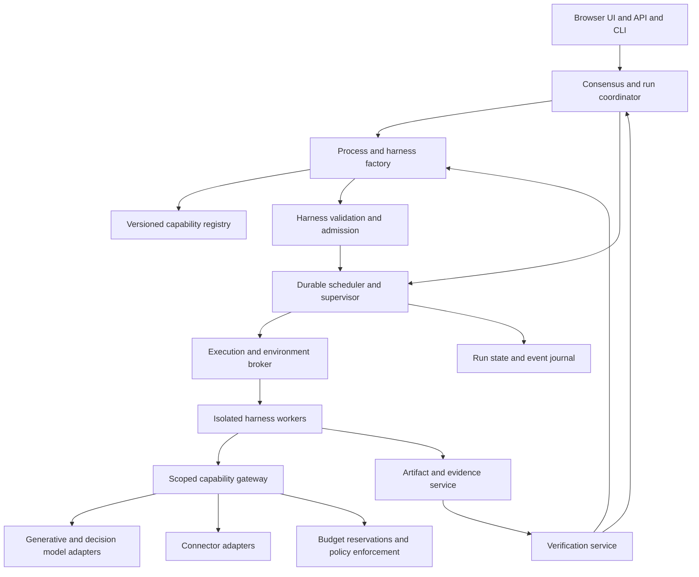

# L2 Technical Brief

Draft for architectural review · October 4, 2026

L2 is a general-purpose successor to Loom. A user supplies a challenge; L2 establishes the intended outcome with the user, designs a process, synthesizes the harnesses needed to execute it, and adapts those harnesses as evidence changes its understanding of the work. A harness may include generated execution logic, tools, decision policies, verifiers, and isolated environments. A stable runtime enforces the user's agreements, authority, budget, and artifact integrity throughout execution.

This brief defines product behavior, architectural boundaries, proposed contracts, decision-model opportunities, and an implementation sequence. It is a design document, not an implementation or a claim that L2 already exists. The education and construction examples test generality; neither supplies domain concepts to the core runtime.

## 1. Decisions established with the user

The following requirements are established. Technical choices elsewhere are proposals unless explicitly identified as established.

| Area | Established direction |
| --- | --- |
| Product | General-purpose successor to Loom; no requirement to preserve its implementation or process format |
| Synthesis | Full synthesis, including new tools and execution-loop logic where useful |
| Adaptation | Ongoing adaptation of harnesses and the overall process |
| Consensus | Surface unresolved choices whose meaningfully different answers materially change the output; show the recommended path and justification; always permit a typed response |
| Scope | Minimize consequential assumptions and detect changes in meaning, emphasis, audience, and intended use throughout the run |
| Economics | Propose an approximate budget for acceptance or rejection; track budget against actuals; allow explicitly approved increases |
| Decision models | Analyze their use throughout L2 to improve inputs, outputs, context efficiency, execution, and economics |
| Deployment | Docker deployment for the L2 core, with separately isolated generated workloads |
| Interface | Browser UI served by the Docker deployment, plus API and CLI for automation |
| Identity | One connection profile per instance; one configured account selection per connected service; separate identities use separate instances |
| Extensions | Generated code and dependency installation may execute in isolation within approved limits; new credentials, paid service commitments, and broader access require a user decision |
| External actions | Staging is autonomous within scope; publication and consequential external actions require authorization unless already granted |
| Reuse | Persist versioned harnesses, tested tools, decision policies, and explicit preferences; project evidence stays project-scoped |
| Design examples | A complete Texas grade 7 mathematics course delivered through an existing learning framework; a construction estimate from a supplied folder |

The first-release proposal is single-user, with concurrent runs and harnesses. Organization administration, multiple authentication profiles, and multi-user consensus are outside that release. An instance may connect to several services and model providers without introducing several identity profiles.

## 2. What changes from Loom

Loom's ad hoc path already transforms a free-form goal into a process with phases, dependencies, acceptance criteria, deliverables, and tool requirements. L2 extends that design activity to the execution system for each step. The factory asks both what work is necessary and what observations, actions, feedback, and environment will make that work succeed.

The source inspection below is a limited review of the current working tree, which contains local modifications. It establishes mechanisms present in the code, not proof of their production reliability or a diagnosis of every reported failure.

| Observed Loom mechanism | L2 design implication |
| --- | --- |
| [Ad hoc synthesis](../src/loom/tui/app/process_runs/adhoc.py) and [launch resolution](../src/loom/tui/app/process_runs/lifecycle.py) | Preserve goal-driven design and inspectable synthesis traces; promote factory behavior into a headless application service shared by every interface |
| [Process and phase contracts](../src/loom/processes/schema.py) | Preserve explicit outputs, verification, iteration, and remediation; separate outcome agreements from generated execution specifications |
| [Evidence outside task prompts](../src/loom/state/evidence.py) | Retain durable evidence independently of active context; improve admission and sufficiency checks without deleting excluded evidence |
| [Context budgeting and protected exchanges](../src/loom/engine/compaction_control.py) | Account for complete requests; protect agreements and valid tool exchanges; make context degradation explicit |
| [Typed correction lifecycle](../src/loom/engine/correction/types.py) | Preserve typed failures and progress signals; distinguish repair, harness redesign, process replan, and user intervention |
| [Output coordination](../src/loom/engine/orchestrator/output.py) and [artifact seals](../src/loom/engine/orchestrator/evidence.py) | Use isolated attempts, immutable artifact revisions, controlled promotion, and one owner for final assembly |
| [Run resource limits](../src/loom/engine/orchestrator/budget.py) | Extend counters into durable monetary estimates, reservations, settlement, forecasting, and budget revisions |
| [Question normalization](../src/loom/tools/ask_user.py) and [durable questions](../src/loom/state/migrations/steps/task_questions.py) | Make questions application state with dependencies and answer provenance, independent of a terminal or active model call |
| [Authentication resolution](../src/loom/auth/runtime.py) | Remove profile selection and override precedence; retain scope checks, credential lifecycle, and actionable connection failures |
| [Migration guarantees](DB-MIGRATIONS.md) | Maintain explicit migrations, backups, upgrade verification, and blocking failures rather than silent loss of durable state |

The user-reported market-research failure is a product requirement: material about an audience representing roughly one percent of the stated TAM grew into approximately half the final report. L2 must distinguish evidence relevance from permission to change strategic emphasis. This brief does not claim to have reproduced that historical run.

## 3. Architectural model

L2 has a trusted control plane and an isolated execution plane. Generated code runs only in the execution plane. The factory is powerful application logic with model assistance; it has no special right to change permissions, agreements, or budgets.



These are responsibility boundaries, not a requirement for a microservice per box. Proposed first deployment: a modular application, a durable database, artifact volumes, and a separately privileged execution broker. Model calls, verification, and connector work may run concurrently under one scheduler.

### Responsibility boundaries

| Component | Owns | Must not do |
| --- | --- | --- |
| Consensus service | Outcome revisions, user decisions, unresolved material interpretations | Treat model recommendations or silence as user approval |
| Factory | Process decomposition, harness synthesis, redesign proposals | Grant itself capabilities or revise agreed success conditions |
| Supervisor | Scheduling, leases, checkpoints, cancellation, revisions | Trust worker claims of success without required receipts |
| Capability gateway | Policy checks, scoped operations, usage accounting | Expose raw secrets or arbitrary privileged host operations |
| Context service | Evidence selection, packet construction, lineage | Convert retrieved instructions into authority |
| Verification service | Checks and verdicts against explicit contracts | Let the producer weaken the contract to obtain a pass |
| Environment broker | Provisioning, limits, teardown, execution receipts | Accept unrestricted Docker or hypervisor commands from generated code |
| Registry | Versioned components, evaluation evidence, applicability | Treat one successful run as universal validation |

## 4. Contracts and durable records

Use typed, versioned contracts at all boundaries. JSON is a proposed transport representation, not a commitment to a particular implementation language. Large content belongs in referenced artifacts rather than nested state payloads.

| Record | Essential contents |
| --- | --- |
| OutcomeContract | Goal, audience, deliverables, scope and exclusions, priorities, acceptance criteria, uncertainty expectations, publication authority, originating user decisions, revision |
| ProcessPlan | Nodes and dependencies, input/output contracts, provisional harness needs, checkpoints, completion requirements, cost estimate, revision |
| HarnessSpec | Objective, observations, execution entry point or graph, capabilities, environment, context policy, decisions, verifiers, recovery, resource limits, checkpoint schema, dependency hashes |
| HarnessAdmission | Spec hash, checks performed, fixture results, permission ceiling, permitted operating mode, residual limitations |
| DecisionPolicy | Question, output type, state requirements, applicable domain, provider/version, calibration reference, thresholds, consequences, uncertainty and outage behavior |
| DecisionReceipt | Policy/version, input references, raw typed result, available probabilities, provider-specific confidence, selected action, timing, usage, escalation |
| ContextPacket | Contract revision, objective, admitted excerpts, artifact references, contradictions, open issues, source lineage, token accounting, omitted evidence index |
| UserDecision | Question, distinct options, recommendation and rationale, consequences, typed response, normalized interpretation, affected work, author and time |
| BudgetRevision | Estimate range, authorized ceiling, inclusions, reservations, forecast assumptions, user approval, currency, revision |
| ArtifactRevision | Content hash, media type, producer attempt, input lineage, contract revision, verification receipts, status, retention |
| CapabilityGrant | Run and attempt, permitted operation and resources, expiry, limits, connection binding, approval reference |
| ExecutionAttempt | Spec and input hashes, lease and generation, environment receipt, checkpoint, action receipts, usage, terminal result |

A decision-model result and a user decision are distinct record types. A high-confidence model prediction cannot become a user agreement.

### Proposed harness interface

A harness consumes an objective, approved contracts, immutable input references, and a scoped runtime client. It emits checkpoints, artifacts, observations, and requests for action, clarification, or redesign. It may produce arbitrary generated execution logic inside its environment, but mediated operations use a small runtime interface:

- Observe or retrieve authorized evidence.
- Request an approved tool, connector, model, or environment operation.
- Submit an artifact revision and request verification.
- Persist a checkpoint and progress evidence.
- Propose a user question, harness replacement, process revision, or budget change.
- Finish with artifact references and completion evidence.

Workers do not directly write authoritative run state. The supervisor validates and commits their messages. Custom execution graphs and loops remain possible; checkpoints occur at mediated action boundaries and at explicit worker checkpoints. Arbitrary machine state is not promised to be resumable.

### Illustrative synthesized harness

The following is a proposed L2 specification fragment, not a provider API or finalized schema. It describes a generic comparison experiment that could serve software compatibility, analytical methods, or competing artifact designs.

```yaml
spec_version: 1
objective_ref: outcome/current/comparison
inputs:
  baseline: artifact_ref
  candidate: artifact_ref
  cases: artifact_ref
execution:
  entrypoint: generated_compare.py
  code_ref: artifact_ref
  checkpoint_schema_ref: schema_ref
capabilities:
  - execute_case
  - read_evidence
  - request_model
environment:
  class: disposable_vm
  manifest_ref: artifact_ref
context:
  policy_ref: comparison_context_v1
decisions:
  discrepancy_kind: policy_ref
verification:
  - criterion_ref: outcome/current/behavioral_equivalence
    verifier_ref: independent_comparison_verifier
recovery:
  retry_limit: 2
  on_no_progress: request_harness_redesign
resources:
  budget_allocation_ref: approved_allocation_ref
  environment_lease_ref: approved_lease_ref
outputs:
  observations: structured_artifact
  comparison_report: document_artifact
```

The runtime resolves and pins every reference before admission. The generated program can introduce new analytical logic; it cannot resolve an unapproved capability merely by naming it. Retry counts here are illustrative and must fit the run's policy.

## 5. Synthesis and adaptation lifecycle

1. **Intake:** identify supplied materials, existing agreements, known constraints, and missing capabilities. Preserve the original request.
2. **Bounded discovery:** inspect enough to propose scope, feasible approaches, major decisions, and a budget. Use an explicitly configured discovery allowance or obtain one before paid discovery.
3. **Consensus:** resolve material choices and establish the initial outcome contract and authorized spending ceiling. A declined estimate leads to revision or an orderly stop.
4. **Process design:** propose dependencies and completion evidence. Keep uncertain downstream harness designs provisional.
5. **Harness synthesis:** reuse suitable evaluated components or generate missing logic, tools, verifiers, and environments. Full synthesis is supported from the first complete vertical slice.
6. **Admission:** validate contracts, capabilities, budget bounds, checkpoint behavior, and generated components before activation.
7. **Execution:** run eligible nodes with isolated attempts and explicit artifact handoffs.
8. **Continuous review:** inspect correctness, evidence gaps, progress, scope alignment, and budget forecasts at meaningful boundaries.
9. **Adaptation:** repair locally, redesign the harness, replan the process, or seek user input according to the nature of the failure.
10. **Integration:** verify the assembled deliverable against the outcome contract and its overall balance; prepare a reviewable staged result.
11. **Delivery:** publish only within recorded authority; preserve receipts, limitations, costs, and reuse candidates.

### Three adaptation levels

| Level | Example | Required controls |
| --- | --- | --- |
| Local repair | Retry a transient request or correct a malformed artifact | Bounded attempts, same contract, progress evidence |
| Harness redesign | Replace speculative analysis with a runnable experiment | New spec revision and admission, budget reservation, input compatibility |
| Process replan | Add investigation after contradictory evidence invalidates a dependency | Impact analysis, dependency revision, stale-output invalidation, consensus if outcomes change |

Every redesign names the failed hypothesis, supporting observations, expected improvement, and maximum additional expenditure. Repeated attempts with unchanged failure fingerprints and no progress trigger escalation, not endless variation. The factory itself is subject to budgets, timeouts, and convergence checks; it cannot recursively create unrestricted factories.

The factory starts from a shipped, versioned design protocol and capability catalog. It can generate its own supporting analysis tools under the same admission rules. Replacing the trusted runtime or its enforcement policy is a software upgrade, not ordinary in-run adaptation. This gives full harness synthesis a finite bootstrap boundary.

When a contract or input changes, the coordinator identifies affected artifacts and descendants. Unaffected work may continue. Affected attempts are fenced from promotion until checked or restarted against the new revision. Cancellation and late results are recorded; a late worker cannot overwrite a newer accepted result.

### Generated harness admission

Admission includes schema and dependency validation, allowed capability checks, bounded execution, missing-input behavior, timeout and cancellation tests, artifact path isolation, and success/failure fixture cases. Generated verifiers receive known-valid and known-invalid inputs, including cases the producer did not create. A reviewer examines whether the verifier actually tests the acceptance criterion.

Passing fixtures is evidence, not a proof of arbitrary code correctness. New semantic policies begin in advisory or constrained operation where warranted. For an unvalidated material judgment, obtain stronger review or preserve uncertainty rather than manufacturing certainty. L2 can introduce novel logic during a run without allowing it to bypass the runtime's invariants.

## 6. Consensus and prevention of scope drift

The clarification test is counterfactual: would plausible responses lead to materially different outputs, and are the offered responses meaningfully different? Material effects include audience, emphasis, exclusions, deliverable form, success criteria, cost, timing, and external commitments.

Before asking, the system checks whether the answer is already established or can be discovered from authorized evidence. Questions should not outsource ordinary research or repeat previous agreements. A question can have two paths; L2 must not invent a third equivalent option for presentation symmetry. A necessary factual clarification may be free text without artificial choices.

The question payload includes the unresolved issue, evidence, distinct paths, recommendation, rationale, consequences, affected nodes, and whether independent work can continue. Typed responses are preserved verbatim. If normalization would materially change their meaning, clarify that interpretation; do not require another confirmation of an already clear answer. No response, a preselected option, or an elapsed timeout is approval.

### Evidence and authority remain separate

Maintain distinct categories for user agreements, observed evidence, provisional interpretations, and proposals. A source can support a fact without supporting a change in strategy. An accepted user preference can govern emphasis without making a factual claim true. New evidence that contradicts an agreement's factual premise should reopen the issue with the user rather than be suppressed.

The context service retains applicable agreements in every execution and review packet. Outstanding material assumptions block work that depends on them. Routine reversible execution choices can proceed under the agreed policy and remain inspectable without demanding user attention.

### Market research regression case

Construct a fixture with a broad-market request, an explicitly supplied small segment share, and a retrieved collection disproportionately discussing that segment. L2 must not infer priority from document frequency. It should preserve the agreed emphasis, seek broader evidence if needed, and ask only when a substantive strategic alternative deserves a decision.

Check scope at outline formation, evidence aggregation, section drafting, and final integration. Inspect semantic emphasis and recommendations, not only word count. Market share is not a mandatory space allocation formula: disproportionate emphasis can be justified by explicit strategy or obligations, but that rationale must be established.

The same test applies to test-preparation material taking over a general mathematics course, or a construction estimate silently substituting premium materials. Individually correct outputs can still form an invalid whole.

## 7. Decision models as a shared runtime capability

### Documented capabilities and limits

TypeSafe documents Jev as evaluating typed questions against supplied state. Choice and Score return distributions and confidence; Noul returns a yes probability. It supports independent questions against shared state and recommends narrow judgments composed in code. These capabilities support the proposed decision service; they do not establish L2's workload accuracy. [TypeSafe introduction](https://docs.typesafe.ai/introduction)

Jev's confidence is derived from its distribution and differs by question type. It is not an interchangeable probability of correctness. L2 must retain distributions and provider semantics and evaluate thresholds on representative data. [TypeSafe confidence](https://docs.typesafe.ai/confidence)

OpenAI's September 29 announcement describes Decisions API as Luna-based finite-answer judgments from text or images, initially in limited preview. The reviewed material does not establish a complete public API schema, calibrated probabilities, pricing, or current account access. An OpenAI adapter is a planned integration pending those checks; L2 must not invent an endpoint or assume Jev parity. [OpenAI announcement](https://openai.com/index/devday-2026-recap/)

TypeSafe's published speed and cost comparisons are vendor results with disclosed evaluation caveats. The architectural hypothesis is that frequent narrow judgments improve total economics; no advertised multiplier is an L2 forecast. [TypeSafe launch analysis](https://typesafe.ai/blog/introducing-system-one-models-and-jev)

### Decision service contract

The service advertises actual provider capabilities: supported input modalities and typed results, maximum state and option sizes, distributions when available, version pinning, batch behavior, latency observations, and usage reporting. Unsupported fields remain absent. A generative fallback records a different backend and cannot inherit another model's calibration.

Every policy identifies its question, candidate universe or rubric, required evidence, contract revision, allowed actions, uncertainty route, and validation history. Where relevant, include insufficient-evidence or none-of-the-above outcomes. If a provider cannot express these natively, the surrounding policy must detect insufficiency before making the choice actionable.

Decision responses need not contain prose reasons. A receipt can retain the state, selected evidence IDs, probabilities, and applied rule. If an explanation is needed, a generative model may explain that record; label this as a subsequent explanation, not the decision model's hidden reasoning.

### Opportunity analysis

The following are proposed uses, not claims of measured effectiveness. Each must be compared with code, existing retrieval methods, a generative judgment, and omission of the check. Permissions, arithmetic invariants, and hard budget enforcement stay deterministic.

| Decision area | Required input and bounded judgment | Action and expected value | Error or uncertainty response |
| --- | --- | --- | --- |
| Material clarification | Request, agreements, candidate alternatives; do answers change deliverables? | Surface consequential choices before production | Escalate ambiguous material cases; sample suppressed questions for missed assumptions |
| Option quality | Proposed question and effects of each option; are paths distinct? | Remove cosmetic alternatives and reduce question fatigue | Ask a focused free-text question rather than forcing a menu |
| Task decomposition | Proposed step and capability descriptions; is there a missing prerequisite? | Flag candidate plan defects for the planner | Validate topology in code; use frontier reasoning for complex dependencies |
| Component selection | Objective plus retrieved registry candidates; which fits declared conditions? | Reuse evaluated components and avoid unnecessary synthesis | None fits leads to synthesis; do not force a near match |
| Environment selection | Operations and resource requirements; which permitted class is suitable? | Suggest adequate isolation and compute | Runtime minimum isolation rules override the recommendation |
| Tool exposure | Current objective and tool shortlist; which capabilities are relevant now? | Reduce prompt tool overhead | Keep discovery available; no semantic filter may grant new permissions |
| Retrieval triage | Question, passage, source metadata; does it address an evidence gap? | Admit promising evidence before expensive synthesis | Keep excluded originals and sample false exclusions |
| Novelty | Candidate and existing claim index; is this new information? | Reduce repeated material | Preserve independent corroboration and conflicting findings |
| Source suitability | Claim type, provenance, dates, publisher information | Route uncertain sources for corroboration | Missing metadata stays unknown; relevance does not establish credibility |
| Contradiction detection | Claims with dates, units, scope, and sources | Trigger reconciliation or further retrieval | Do not discard disagreement because it conflicts with a draft |
| Context sufficiency | Objective, prerequisites, packet and omitted index | Detect missing inputs before a costly model call | Expand retrieval or mark the step blocked; repeated checks are bounded |
| Context balance | Agreements and representation across a packet | Detect evidence concentration becoming implied priority | Broaden evidence or request consensus; no demographic quotas inferred |
| Summary fidelity | Summary and referenced source spans | Catch omissions and unsupported additions after compaction | Restore excerpts or regenerate with stronger review |
| Tool outcome triage | Expected result, structured receipt, relevant output | Select retry, repair, new method, or investigation | Transport/auth errors handled directly; unclear causes route to diagnosis |
| Progress assessment | Recent artifacts, failure fingerprints, acceptance gaps | Stop loops without measurable improvement | Deterministic attempt ceilings remain authoritative |
| Extraction checks | Proposed structured fields and source spans | Route only uncertain records to expensive extraction | Arithmetic, units, and schema checks remain executable |
| Claim support | Claim and exact source context | Catch citation mismatch before finalization | Unknown support prompts retrieval or qualified output, not a fabricated citation |
| Semantic acceptance | One criterion, artifact slice, required evidence | Run frequent checks near production | Material or novel cases receive stronger independent verification |
| Visual and media review | Relevant frames/audio or validated representations | Detect selected defects before expensive final assembly | Require native modality support; transcripts cannot prove visual correctness |
| Repair versus redesign | Failed criterion, attempts, environment and progress | Choose which adaptation level to propose | Factory reviews uncertain or high-impact structural changes |
| Scope change | Proposed action and outcome contract | Detect consequential interpretation drift | Hold dependent work and present distinct paths to the user |
| Spending prioritization | Remaining gaps, candidate actions, measured costs | Inform expected-value ranking | User-approved priorities and hard ceilings dominate the recommendation |
| Integration review | Requirement map and assembled artifacts | Detect overlap, contradictions, imbalance, missing handoffs | Reopen affected steps; preserve passed artifacts where still applicable |
| Reuse promotion | Run receipts and held-out evaluations | Identify candidates for future reuse | Promotion needs validation; no self-certification by the authoring model |

### Context pipeline in detail

1. Store original assets with hashes, origin, retrieval time, permissions, and parser version. Preserve page, row, timestamp, or span locations.
2. Perform inexpensive structural extraction, exact duplicate checks, and candidate retrieval. Treat search snippets as discovery rather than complete source evidence.
3. Apply focused judgments to candidate passages using the current evidence gaps and outcome contract. Evaluate relevance, novelty, support, and contradiction separately.
4. Admit excerpts or commission extraction/summarization only where justified. A typed decision model selects or evaluates content; it is not assumed to generate arbitrary summaries.
5. Assemble a packet containing applicable agreements, the step's objective, evidence, counterevidence, unresolved questions, and enough operational state to execute correctly.
6. Check coverage and balance across the packet. A collection of individually relevant passages may still omit an essential perspective or prerequisite.
7. Account for the full model request, including instructions, tools, attachments, history, and output reserve. Preserve valid tool-call/result relationships. If protected material cannot fit, split the task or change the model rather than silently dropping agreements.
8. Record the packet hash and admission decisions. The worker can retrieve originals or request more context. Exclusion from a packet does not delete an asset.

Selection is stage-specific: a passage unnecessary for drafting may be essential for verification. Reviewer retrieval must not depend exclusively on the producer's selected context. A user correction invalidates affected packet caches. Summaries retain derivation links and cannot outrank their sources.

### Policy evaluation and calibration

Use representative fixtures with clear labels where available, including missing evidence, misleading options, contradictions, prompt injection, shifted domains, and minority-but-important evidence. Split policy development examples from held-out evaluation. Model-generated labels may bootstrap exploration but cannot be the only ground truth for acceptance.

Measure action-specific error rates and abstention coverage. For probabilities, evaluate reliability across probability ranges and proper scoring metrics where appropriate. For source exclusion, prioritize recall of necessary evidence; for acceptance, measure false passes. Model confidence must not be multiplied across dependent judgments as if errors were independent.

Deployment states are proposed as experimental, shadow, advisory, active, and retired. Shadow decisions do not control execution. Novel policies within a live run can operate with stronger supervision while data accumulates. Revalidation is required when the question, rubric, provider version, input distribution, or consequences change. A provider outage invokes the declared fallback or pauses the relevant branch; it never silently passes verification.

Generated questions can be gamed or poorly scoped. Validate both the question and its mapping to an action. Independently check permission and spending gates regardless of the answer. Content describing instructions is evidence, not a trusted policy update.

### Economics and scheduling

Evaluate net value as avoided frontier work and avoided rework, minus decision calls, added latency, escalation, and losses caused by incorrect decisions. Lower prompt token counts alone do not establish better economics: total cost to an accepted outcome is the primary comparison.

An illustrative calculation, not a price quote: if 100 repeated calls each avoid 12,000 input tokens at an assumed $2 per million tokens, gross input savings are $2.40. Decision processing costing $0.15 would leave $2.25 before extra retrieval, caching effects, and rework. One erroneous exclusion causing a $3 rerun would erase that gain. Actual pricing must come from the configured providers at execution time.

Batch independent questions over shared state when supported. Separate dependent decisions into stages. Cache only against complete semantic keys: evidence content, agreements, question and rubric, provider/version, policy, and relevant freshness. Reuse is project-scoped unless explicitly safe to broaden. Do not evaluate every possible speculative question simply because each is cheap.

Compare four experimental configurations on the same fixtures: no new gate, deterministic gate, decision-model gate, and frontier-model gate. Include context-only and combined interventions to isolate benefits. Track cost, latency, final acceptance, evidence recall, escalation rate, repair counts, and user interruptions. Retain a gate only when the measured quality/cost tradeoff justifies it.

## 8. Verification architecture

Verification is a set of strategies chosen for the criterion, not one universal score.

| Strategy | Appropriate evidence | Limits |
| --- | --- | --- |
| Structural | Schemas, required files, links, units, counts | Does not establish semantic quality |
| Executable | Tests, calculations, simulations, differential outputs | Only covers specified properties and exercised cases |
| Semantic decision | Narrow claim or criterion with supporting context | Requires task-specific evaluation and uncertainty handling |
| Independent generative review | Complex reasoning, contradictions, design critique | Can share errors with the producer; use independent evidence |
| Visual or media inspection | Rendered pages, browser state, frames, audio | Must inspect the actual modality and final artifact |
| User review | Material preferences, representative deliverables, final commitments | Must not become a substitute for checks L2 can perform |
| Field evidence | Learner outcomes, operational measurements, actual project results | Often unavailable during production; report the boundary |

Verdicts are pass, fail, inconclusive, or verifier error. Verifier failure is not artifact failure, and missing evidence is not a pass. Hard requirements cannot be averaged away by high quality scores elsewhere. Record criteria separately from preferences and advisory improvements.

Check artifact integrity, semantic correctness, agreement alignment, and whole-output balance. Producer and verifier roles may use different providers or methods, but provider diversity alone does not prove independence. Source overlap and derivation lineage matter.

Generated verifiers cannot revise the criteria they enforce. Any proposed relaxation becomes a visible contract change. Publication checks bind to the artifact hash and destination; editing an approved artifact invalidates approval when the change is material.

## 9. Docker deployment and execution isolation

The core is packaged for Docker with persistent database and artifact storage. Generated work never executes inside the core application's process. Proposed deployment uses a non-root core, constrained network access, separate worker networks, and a narrowly exposed environment broker.

Docker's documentation describes the privileged daemon attack surface and the risks of unrestricted host mounts; container configuration is part of the security boundary. L2 therefore does not expose a Docker socket or unrestricted daemon API to generated workers. Rootless operation should be evaluated where supported, rather than assumed to make arbitrary code safe. [Docker security](https://docs.docker.com/engine/security/) · [Rootless mode](https://docs.docker.com/engine/security/rootless/)

Proposed execution classes:

| Class | Use | Controls |
| --- | --- | --- |
| Restricted container | Ordinary generated utilities and supported tests | Unprivileged user, resource and process limits, minimal mounts, explicit network policy |
| Disposable VM or equivalent stronger boundary | Higher-risk dependencies, unfamiliar code, complex experiments | Separate guest boundary, no implicit host shares, controlled ingress/egress, disposable state |
| Dedicated remote environment | Specialized compute or workloads unavailable locally | Approved provider, explicit data transfer, budget reservation, leases and cleanup |

Exact VM technology and host support remain implementation decisions. If the required isolation is unavailable, the run reports a missing capability; it does not downgrade silently. Start with Linux as a proposed execution baseline and validate Docker Desktop operation separately.

The broker enforces allowed images, mounts, ports, resources, and lifetime. It returns environment IDs and receipts rather than host command authority. Generated dependency installation occurs in disposable build environments with locked manifests and captured hashes. Sensitive connector credentials remain outside them. Network grants distinguish package retrieval from arbitrary external access.

Paid model and service operations must traverse metered gateways. A worker cannot evade reservations by making a direct authenticated HTTP call. Where an approved external job has its own internal spending, reserve and constrain that job as a whole. Infrastructure enforcement, rather than generated-code cooperation, supplies these boundaries.

Environment leases survive coordinator restarts. A reaper tears down expired or abandoned resources and reconciles billing. Checkpoint artifacts are exported before normal teardown. Secret-bearing memory snapshots are not promoted into reusable harness templates.

## 10. Connectors and one profile per instance

Use a connector interface for authenticated external systems, separate from local/generated tools and model-provider adapters. Expose all three through a common capability catalog where useful without conflating their credential or lifecycle semantics.

A connector advertises versioned operations, input/output schemas, side-effect class, idempotency support, cancellation and reconciliation behavior, resource scopes, health, rate limits, and cost information when available. Discovery returns a shortlist; full operation schemas are loaded on demand. This avoids injecting every connected operation into every model request.

MCP is a proposed interoperability path alongside native HTTP adapters. Its authorization specification addresses HTTP authorization and resource-bound tokens; protocol compliance does not establish that a server or its tool descriptions are trustworthy. Pin supported protocol versions and test compatibility. Follow the authorization flow for the selected transport. [MCP authorization specification](https://modelcontextprotocol.io/specification/2025-11-25/basic/authorization)

### Identity simplification

An instance has one connection profile. Each canonical service binding has one account identity and credential set. Runs can restrict resources and scopes but cannot select another account. Registering the same service under another alias must not become a back door to multiple profiles. Different services and different model providers remain possible.

Token refresh is an ordinary credential lifecycle operation. Account replacement is an explicit administrative action: pause affected work, record a binding revision, invalidate dependent grants, and require revalidation before resume. Never silently rebind a running task to another account.

The credential service stores secret references and protects resolved values from prompts, logs, generated code, and ordinary artifacts. Scoped runtime grants authorize operations through the gateway; they are not the provider's raw credentials. The exact secret-storage backend is a deployment choice. Secret backups and encryption-key recovery need an explicit operator procedure.

Connection states include disconnected, authorizing, ready, degraded, expired, and revoked. Failures distinguish authentication, insufficient scope, rate limiting, transport errors, and ambiguous external outcomes. Broader scopes need consent; a model classification cannot grant them.

A newly generated adapter starts as an isolated staged tool with fixtures and mocked credentials. Registering it as an authenticated connector requires explicit permission and capability validation. Connector metadata and results are untrusted input. External actions remain subject to the same approval boundary regardless of whether they originate from a connector, browser, or generated script.

## 11. Budget agreement and enforcement

Discovery produces a range and expected cost, an authorized ceiling, included services, main cost drivers, assumptions, and optional scope reductions. The user may accept, decline, or revise. Expected cost is not a spending permission by itself. No monetary estimate for the full example course is asserted in this brief.

Track actual settled spend, outstanding reservations, estimated remaining unreserved work, forecast total, and original versus revised ceilings. Keep currency and price-version metadata. Track model calls, tokens, compute, paid tools, storage, and media separately. Local compute may have a declared imputed cost while cash spend remains separately visible. Human time is not silently monetized.

Before a paid operation, atomically reserve a conservative bound. Admission requires settled spend plus outstanding commitments plus the new reservation to fit the authorized ceiling. Settlement replaces its reservation with actual cost; do not count both. Concurrent harnesses share the ledger, preventing each from independently spending the same remaining allowance.

Providers may have delayed billing, uncertain charges, or non-cancelable jobs. Use output/time caps, conservative reservations, and an explicitly disclosed contingency inside the ceiling. Refuse unattended operations with unbounded financial exposure. A hard provider-level cap cannot be promised when the provider offers none; make residual uncertainty visible before authorization.

Forecast changes can trigger a budget question before the ceiling is reached. Offer an increase, a meaningful scope/method adjustment, or an orderly stop with completed artifacts. Preserve every revision and reason. Reserve enough for durable checkpointing and required cleanup; an exhausted budget must not leave paid environments running indefinitely.

## 12. Persistence and recovery

Proposed first-release storage is PostgreSQL for authoritative records and a content-addressed artifact volume with an object-store adapter boundary. This is a recommendation for concurrent reservations and durable scheduling, not a user-established requirement. SQLite remains a possible simpler deployment alternative if its operational tradeoffs meet the same invariants.

The coordinator owns canonical state. Append event records in the same transaction as state transitions; publish UI notifications through a transactional outbox. Events provide traceability without making several partially synchronized files independent authorities.

Proposed run states are discovery, awaiting agreement, ready, running, paused, integrating, awaiting delivery approval, completed, failed, and canceled. Record blocking reasons separately: a run may have pending questions while independent nodes remain running. Attempts have their own queued, leased, running, checkpointed, verifying, succeeded, failed, and superseded states. Each transition requires the expected revision and applicable receipts; a worker's final message alone cannot complete a run.

Use leases and fencing generations for workers. Delivery of queued work may be repeated; external effects must use idempotency keys where supported. When an external action's result is unknown, reconcile its status before retrying. Do not claim exactly-once execution across arbitrary services. User decisions and publication receipts bind to the relevant run, action, revision, and artifact.

At restart, reconstruct active runs from durable records, expire stale leases, reconcile reservations and external jobs, and resume from supported checkpoints. A checkpoint identifies the execution spec, input artifacts, contract, completed operations, and continuation state. Replaying a trace for diagnosis must not reissue external effects.

Preserve original artifacts and promote immutable revisions through staged, verified, and delivered states. Concurrent attempts write separate namespaces. Final assembly owns its output revision; promotion uses expected-revision checks. Changes to inputs or agreements mark dependent evidence stale until reviewed.

Schema upgrades require migrations, backup/restore tests, and explicit operator errors. No silent ephemeral fallback for failed upgrades. Retention and deletion operate on project evidence, artifacts, logs, and caches consistently; derived data cannot survive a deletion policy merely because it lives in a summary or embedding.

## 13. Browser experience and automation API

The browser presents the agreed outcome, process view, active harnesses, question inbox, artifact previews, verification status, and budget-to-actual. Users can inspect a harness's capabilities and revisions without reading generated code by default. Technical traces remain available for diagnosis.

Questions show why an answer changes the output, the recommended route, alternatives, and free text. Pending questions identify blocked work and independent work still proceeding. The UI distinguishes technical verification from user acceptance and external publication.

Run controls include pause, resume, cancel, revise scope, answer questions, and propose/approve budget changes. Pausing checkpoints work and handles continuing external jobs explicitly; cancellation reports cleanup and any irreversible effects. A browser disconnect does not stop or approve anything.

The API and CLI operate on the same commands and state machine. Proposed resources include runs, contracts, questions, budgets, artifacts, harness revisions, connectors, and events. Mutating requests carry idempotency and expected-revision fields. Event streaming supports replay from a cursor. Headless runs pause for unresolved material decisions unless an applicable policy or answer is already authorized.

The web UI still requires access control despite being single-user. Bind locally by default; remote exposure requires an explicit authenticated deployment configuration. Interactive artifact previews execute in a separate restricted origin or sandbox without access to the control-plane session or connector secrets.

## 14. Cross-run reuse

Reuse candidates include execution patterns, generated utilities, harness packages, decision policies, verifier fixtures, and explicit preferences. Store applicability conditions, versions, dependencies, evaluation results, provenance, and known failures. Distinguish a reusable template from a run-specific instance containing private evidence.

A successful run nominates a component; promotion requires additional checks. Later failures can quarantine a version without corrupting historical receipts. Retrieval favors validated fit, not popularity alone. Users can inspect and revoke remembered preferences. Cross-project evidence use requires explicit authorization; sharing a runtime profile is not that authorization.

## 15. Worked design cases

### Course production

The challenge is a complete Texas grade 7 mathematics course with explanations, interactive activities, media, quizzes, feedback, and delivery through an existing framework. No platform is selected and no curriculum claims are made here. A real run must establish authoritative standards and the chosen framework's capabilities.

Discovery resolves learner context, instructional approach, platform constraints, accessibility expectations, assessment behavior, scope, and budget. Present platform alternatives only after identifying meaningful requirements. Use a representative lesson to reach consensus on the actual experience before scaling production.

The factory may synthesize source-verification, curriculum-mapping, instructional-design, interactive-development, media-production, assessment, and integration harnesses. These are run artifacts assembled from generic capabilities. They are not new core runtime types.

Adaptation example: an interactive activity passes arithmetic checks but permits guessing. The local verifier records that specific instructional gap. After bounded repair fails, the factory proposes a revised interaction loop and tests it. If the change stays within the agreed experience and budget, it proceeds; a change from interactive activities to static worksheets requires consensus.

Acceptance includes traceable standards coverage, correct mathematics, functional activities, independently solved assessments, usable media, accessibility alternatives, framework import, and whole-course alignment. Actual learning effectiveness remains a field-evidence question. A production review cannot certify student outcomes that have not been measured.

### Construction estimate

The challenge is an estimate from drawings, specifications, schedules, and other supplied project files, with material details confirmed during work. Discovery establishes scope, location, currency, pricing date, required estimate form, exclusions, allowances, and the user's confirmation expectations.

The factory may synthesize document reconciliation, quantity extraction, calculation, rate sourcing, ambiguity resolution, and estimate assembly harnesses. Every material quantity and rate retains its source or approved assumption. Missing dimensions, conflicting revisions, material substitutions, and substantial allowances become user decisions where investigation cannot resolve them.

Executable checks handle units, extensions, aggregation, duplication, and reconciliation. Decision models identify candidate ambiguity and source mismatch; they do not replace arithmetic or manufacture missing quantities. Specialized drawing interpretation requires suitable tools and validation. The system reports uncertainty rather than implying professional certification.

Adaptation example: a later drawing revision invalidates quantities already calculated. L2 identifies affected items through lineage, reruns the necessary work, forecasts the added cost, and raises any changed scope for consensus. Unaffected items remain reusable. Preparing the estimate and submitting a bid are separate authorizations.

### Additional generality tests

Use a software compatibility experiment and a market-research strategy as smaller acceptance cases. All four domains should execute through the same contracts, scheduler, connector system, budget ledger, and decision service. Domain-specific criteria belong in generated specifications or optional packages.

## 16. Evaluation and release gates

L2 succeeds when it produces outputs aligned with agreements at acceptable cost and with recoverable execution. No single model score determines release readiness.

| Test | Required outcome |
| --- | --- |
| Undefined challenge | Synthesizes a process and at least one novel executable harness without a hand-authored domain workflow |
| Generated harness defect | Admission detects a deliberately broken verifier or prohibited capability request |
| Live redesign | Changes execution strategy with new evidence while preserving authority, cost accounting, and lineage |
| User scope revision | Invalidates affected work and prevents stale completion from promotion |
| Market emphasis drift | Maintains agreed scope despite skewed retrieval; asks only for a substantive unresolved alternative |
| Decision filtering | Measures useful-evidence recall and end-to-end quality against unfiltered and frontier-reviewed baselines |
| Provider outage | Uses declared fallback or pauses; never records an unsupported verification pass |
| Concurrent spending | Reservations cannot oversubscribe authorized capacity; settlement survives interruption |
| Crash recovery | Resumes questions, checkpoints, jobs, and budgets without duplicating external effects |
| Connector identity | No per-run profile selection or silent identity substitution; refresh and revocation work |
| Publication | Approval applies to the correct destination and artifact revision |
| Environment cleanup | Cancellation and restart do not leave unmanaged paid workers running |
| Generality | Different domains need domain specifications, not changes to core orchestration |

Measure acceptance rate against the outcome contract, cost per accepted result, elapsed time, unproductive retries, user interruptions, material assumptions missed, necessary evidence excluded, and recovery success. Establish thresholds on a documented representative evaluation set before claiming savings or reliability. Separate runtime invariants, which need strict tests, from statistical model performance with uncertainty bounds.

## 17. Proposed implementation sequence

1. **Control-plane foundation:** contracts, durable state, consensus questions, budget reservations, artifact revisions, browser/API/CLI skeleton, and a fake-provider test harness.
2. **Full-synthesis vertical slice:** generate and admit a small executable harness, run it in isolation, verify an artifact, and recover from an interrupted attempt. Include generated logic rather than limiting the slice to template selection.
3. **Decision and context service:** implement one available provider, policy receipts, reversible admission, shadow evaluation, and measured comparisons. Add providers only against verified APIs.
4. **Adaptation:** harness replacement, process revision, dependency invalidation, progress-aware recovery, and user changes during execution.
5. **Connectors and stronger environments:** one-profile account lifecycle, staged external writes, disposable VM/remote adapter, billing reconciliation, and failure tests.
6. **Cross-domain trials:** representative course unit, construction subset, software experiment, and market-drift fixture; then larger course/estimate runs within approved budgets.
7. **Reuse and operational hardening:** evaluated registry promotion, upgrade and backup drills, retention, and performance tuning based on measured bottlenecks.

These are engineering increments, not a retreat from full synthesis. A release called the general-purpose L2 should demonstrate adaptation and multiple domains; a course-generation demo alone is insufficient.

## 18. Open technical decisions

The following proposals can be resolved through focused design spikes without reopening established product requirements. Escalate if a choice materially changes access, cost, supported deployment, or deliverables.

| Decision | Proposed starting point | Evidence needed |
| --- | --- | --- |
| Backend and worker language | Typed Python application contracts; generated workers through a language-neutral protocol | Familiarity, isolation packaging, SDK support, concurrency tests |
| Browser stack | TypeScript UI over a versioned API | Artifact preview and streaming needs; avoid dependence on a desktop shell |
| Durable scheduler | Database-backed leases and explicit transitions initially | Recovery complexity and load before selecting an external workflow engine |
| Database | PostgreSQL in the deployment | Operational burden versus transaction/concurrency requirements |
| Strong isolation provider | Pluggable VM or remote environment broker | Host compatibility, isolation tests, startup latency, cleanup and billing behavior |
| Decision providers | Jev as an evaluated candidate; OpenAI Decisions when access and schema are verified | Live capability, cost, latency, and task-level calibration tests |
| Initial connector set | Files, web retrieval, a repository service, and one delivery target selected for trials | Actual workload needs and supported authentication flows |
| Discovery allowance | Explicit instance-level allowance with a per-run disclosure | User's preferred cap; no assumed dollar amount |
| Evaluation thresholds | Action-specific quality and cost criteria | Representative held-out fixtures and acceptable error consequences |
| Delivery framework for course | Choose during the example run's discovery | Required interactions, import/export, accessibility, hosting and publication permissions |

## 19. Review checklist

Before implementation, review whether this brief faithfully preserves full synthesis, ongoing adaptation, material consensus, affordable decision use, Docker isolation, one-profile connections, and domain independence. Next technical work should turn the proposed records and lifecycle into interface specifications and an executable vertical-slice plan. No production credentials, deployments, paid resources, or application code changes are required to review this design.
